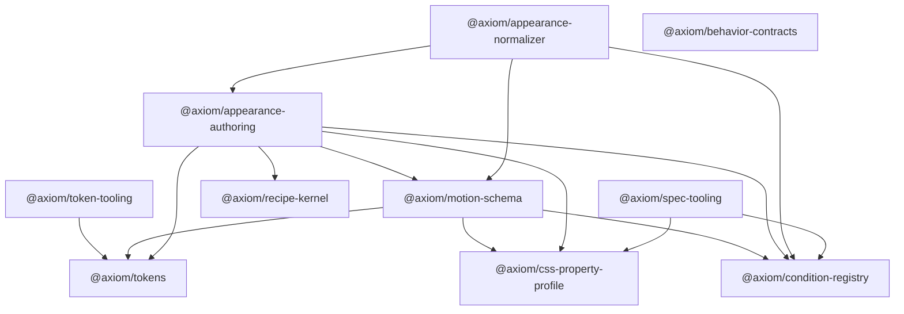

# Axiom implementation architecture

This document is the implementation map for the repository. Normative behavior
is owned by the accepted ADRs, SSOT documents, and `spec/`; this map explains
where implementations belong and which dependency directions are legal.

## Authority flow

```text
ADRs + SSOT
    ↓
schemas + registries + source profiles
    ↓
conformance fixtures
    ↓
contracts and capability packages
    ↓
generated artifacts and framework projections
```

Implementation code may prove or realize a normative contract. It may not
silently amend one. A contract change starts in an ADR or the owning SSOT and is
then reflected in schemas, fixtures, types, and implementation in that order.
An explicit owner-approved requirement enters this flow as ADR decision input;
it does not insert implementation above SSOT. The Token clean break follows
this rule through ADR-0004 and SSOT-01 v0.4.0.

## Current package graph



- `@axiom/spec-tooling` is repository tooling. It consumes the public
  `@axiom/css-property-profile` and `@axiom/condition-registry` APIs one-way while validating
  cross-registry State, Condition, resolved Token, Appearance IR, and Motion IR
  invariants before generating drift-checked reference contracts. Generated
  `@axiom/condition-registry`, `@axiom/motion-schema`, and
  `@axiom/behavior-contracts` modules do not runtime-import `@axiom/spec-tooling`.
- `@axiom/tokens` is target-neutral. It must not import React, renderer,
  Tailwind, browser, or framework concepts.
- `@axiom/token-tooling` is an adapter boundary. Parser-specific values stop at
  this package; consumers receive Axiom contracts.
- `@axiom/css-property-profile` owns pinned Webref import, sparse policy
  resolution, Token Binding coverage, generated property types, and CSS grammar
  validation. It does not depend on Token runtime, Recipe, React, or a renderer.
- `@axiom/condition-registry` publishes generated State/Condition contracts and
  analyzes bounded Condition relationships without reading browser state.
- `@axiom/behavior-contracts` publishes generated Behavior criteria types and has
  no runtime behavior or dependencies.
- `@axiom/recipe-kernel` validates and snapshots renderer-neutral Recipe structure.
- `@axiom/appearance-authoring` specializes the Kernel with CSS, State, Condition,
  and Token Binding authorities; its result is not yet Appearance IR.
- `@axiom/appearance-normalizer` revalidates an authenticated Recipe and lowers it
  to Appearance IR plus a separate collision trace. It emits no CSS or classes.
- `@axiom/motion-schema` owns generated Appearance/Motion contracts and N23 Motion
  authoring normalization. Its trusted specification-validation port is injected
  by the composition root rather than imported from spec tooling at runtime.

## Token package structure

```text
packages/tokens/src/
├── constants.ts
├── contracts.ts
├── domain/
│   ├── identity.ts
│   ├── identity.test.ts
│   ├── token-json-value.ts
│   └── token-json-value.test.ts
├── resolution/
│   ├── context-resolver.ts
│   ├── context-resolver.test.ts
│   ├── manifest-index.ts
│   └── manifest-serializer.ts
├── generated/
│   └── token-paths.ts
└── index.ts
```

`constants.ts` owns package-wide protocol and policy values. `contracts.ts`
owns serializable types and typed errors. Domain directories own cohesive
behavior and colocated tests. `index.ts` is the only supported public entry
point and contains exports rather than implementation.

## Normative and executable boundaries

| Concern | Authority | Executable owner |
| --- | --- | --- |
| Architecture and dependency direction | `docs/adr/`, `docs/ssot/` | boundary checks in `scripts/` |
| Schema and registry shape | `spec/**/*.schema.json`, `spec/manifest.json` | `@axiom/spec-tooling` |
| Token identity and tier rules | SSOT-01 and token schemas | `@axiom/tokens` |
| DTCG parser integration | token source profile | `@axiom/token-tooling` |
| Token source corpus and resolved manifests | SSOT-01 and `tokens/` | `@axiom/token-tooling`, `@axiom/tokens` |
| CSS property identity and policy | SSOT-03, Webref input manifest, CSS registries | `@axiom/css-property-profile` |
| Canonical State and Lifecycle identity | SSOT-05, Canonical State Registry | `@axiom/spec-tooling` semantic gate |
| Environment conditions and responsive thresholds | SSOT-04, Condition Registry | `@axiom/spec-tooling` semantic gate |
| Ordered declarations and Appearance IR | SSOT-03, declaration/Appearance schemas | `@axiom/spec-tooling` schema and semantic gates |
| Renderer-neutral Recipe structure | ADR-0003, SSOT-03 | `@axiom/recipe-kernel` |
| CSS-aware Recipe and Token receipt | SSOT-03, CSS/Token/State/Condition authorities | `@axiom/appearance-authoring` |
| Appearance normalization and collision trace | SSOT-03, Appearance/collision schemas | `@axiom/appearance-normalizer` |
| Motion authoring and Motion IR | SSOT-04, Motion schema | `@axiom/motion-schema` |
| Generated State, Condition, Appearance, Motion, and Behavior references | completed schemas and registries | `@axiom/spec-tooling` generator and the three generated contract packages |
| Positive and negative behavior | `spec/fixtures/`, `fixtures/` | package tests and spec harness |

## Current N24 checkpoint

The `spec/manifest.json` inventory contains 37 schemas, 14 registries, 44
positive fixtures, and 87 negative fixtures. Token generation emits the same
635 Token IDs for light and dark contexts, and the effective CSS registry
contains 818 properties.

N19–N23 add the renderer-neutral Recipe Kernel, CSS-aware authoring, authenticated
Token Binding receipts, Appearance normalization with a separate collision trace,
and Motion authoring normalization. N24 proves one Button vertical slice through
those public boundaries, schema and semantic validation, JSON transport, and
deterministic canonical bytes.

The current boundary does not emit CSS or class names and does not implement DOM,
React, provider, or accessibility runtime behavior. N25–N26 own Select and Dialog
vertical fixtures, N27 owns exhaustive negative/type/round-trip/determinism
coverage, N28 is the Foundation reconciliation review, and N29 onward remain
compiler/integration work. Later backend and provider capabilities remain planned
under their owning sequence.

## Change gate

Every source change must pass:

1. `pnpm check` for naming, constants policy, package boundaries, spec integrity,
   and type safety;
2. `pnpm test` for executable behavior;
3. `pnpm build` for package outputs.

The complete source-writing and module rules are normative for contributors and
automation: [Source-code and module structure](standards/source-code-and-module-structure.md).
