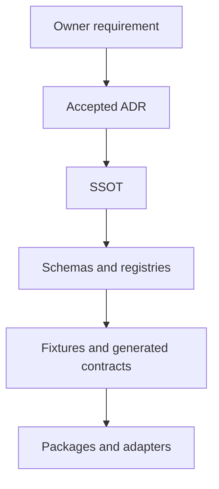
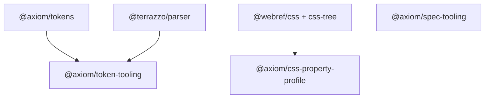
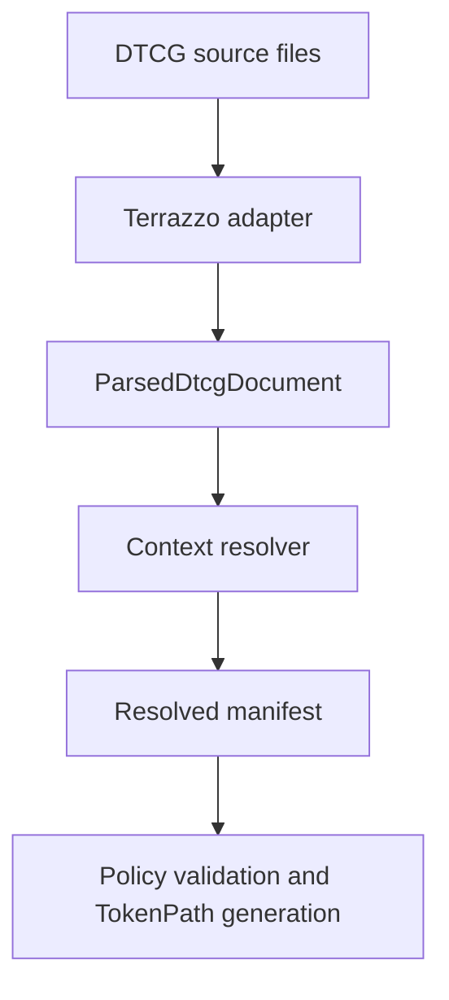
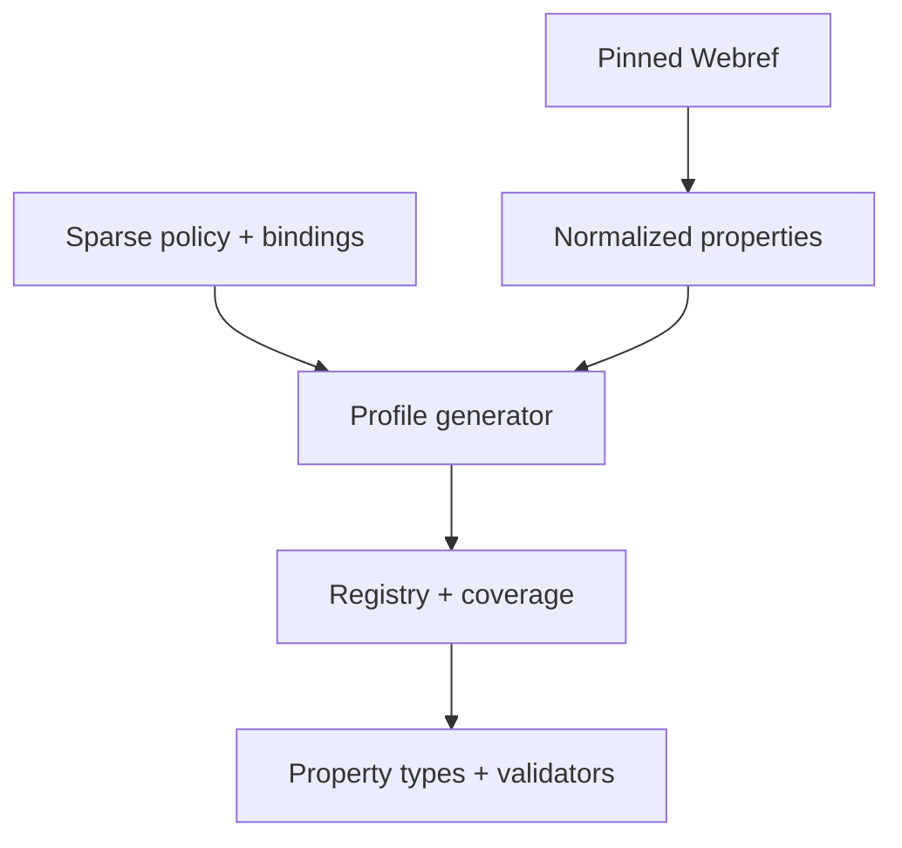
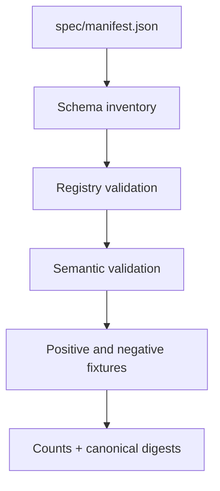

# Axiom Repository Guidebook

**Orientation:** Non-normative\
**Language:** 한국어 설명과 영문 code identifier·signature·path\
**Implementation baseline:** N0–N15, `main` `4546147ba7537aee9188a82b3f35fe266f2f1422`

이 책은 Axiom 저장소를 처음 보는 contributor가 처음부터 끝까지 읽으며 하나의
mental model을 만들 수 있도록 구성한 구현 안내서다. 현재 구조를 이해하고 코드를
찾는 출발점이지, 새로운 규칙을 만드는 문서는 아니다. 보장과 규범의 실제 소유자는
[documentation authority index](README.md)에 정의된 ADR, SSOT와 machine-readable
`spec/`다.

## 1. 이 책을 읽는 방법

처음 방문했다면 1–7장을 순서대로 읽는다. 그러면 “무엇이 authority인가”, “데이터가
어디서 어디로 흐르는가”, “네 package가 왜 분리되어 있는가”가 연결된다. 실제 변경을
준비할 때는 package guide와 change recipe로 이동한다. 특정 symbol을 찾는 경우에는
8–12장의 package/module reference에서 path나 symbol을 검색한다.

이 책에서 사용하는 표현은 다음처럼 구분한다.

| Expression | Meaning |
| --- | --- |
| **owns** | 해당 경계가 contract나 behavior의 변경 책임을 가진다 |
| **validates** | 더 높은 authority가 정한 규칙을 검사한다 |
| **generates** | pinned input으로부터 byte-stable artifact를 만든다 |
| **adapts** | 외부 형식을 Axiom-owned contract로 변환하고 외부 type을 차단한다 |
| **planned** | SSOT에는 필요하지만 현재 package graph에는 아직 없는 기능이다 |

### 현재 checkpoint

이 문서가 처음 작성된 N0–N15 checkpoint는 다음과 같다. 숫자는 architecture 상수가
아니라 command로 다시 계산되는 inventory다.

| Inventory | Current value | Verification owner |
| --- | ---: | --- |
| Workspace packages | 4 | `pnpm-workspace.yaml` |
| Handwritten/generated non-test package modules | 44 | `pnpm guidebook:check` |
| Repository policy scripts after this guide | 4 | `pnpm guidebook:check` |
| Schemas / registries / fixture suites | 33 / 14 / 23 | `pnpm spec:check` |
| Positive / negative spec fixtures | 26 / 57 | `pnpm spec:check` |
| Resolved Token IDs per light/dark context | 635 / 635 | `pnpm tokens:check` |
| Effective CSS properties | 818 | `pnpm profile:check` |
| Unit tests before the guidebook checker | 87 | `pnpm test` |

N16 Motion IR, N17 Behavioral Criteria contract와 그 뒤 compiler/runtime package는
여전히 planned scope다. [current architecture](architecture.md)의 current graph와
[SSOT-02](ssot/02-adapter-contract-readiness-and-governance.md)의 implementation order를
혼동하지 않는다.

## 2. Axiom을 한 장으로 이해하기

Axiom은 component library에서 출발하지 않는다. 사람이 작성하는 Token과 Recipe,
외부 표준 데이터, State와 Condition을 먼저 **검사 가능한 contract**로 고정하고,
compiler와 runtime은 그 contract를 소비한다. 따라서 TypeScript 구현이 먼저 새
규칙을 발명할 수 없다.



권한 순서는 다음과 같다.

1. architecture를 수정하는 accepted ADR
2. system/domain SSOT
3. `spec/`의 schema, registry, pinned input manifest
4. positive/negative conformance fixture와 golden artifact
5. generated TypeScript/reference definition
6. compiler/runtime implementation
7. example과 historical report

명시적으로 승인된 owner requirement가 출시 전 계약과 충돌하면 기존 구현을 억지로
SSOT에 맞추지 않는다. requirement를 ADR decision input으로 기록하고 SSOT와
machine-readable contract를 reconcile한 뒤 위 순서를 다시 적용한다. Token clean
break는 [ADR-0004](adr/0004-token-vocabulary-and-color-profile.md)와
[SSOT-01](ssot/01-foundation-and-domain-contracts.md)이 이 절차를 적용한 사례다.

### 서로 섞지 말아야 하는 네 축

| Axis | Question | Example |
| --- | --- | --- |
| Token resolver context | 어떤 환경별 값 그래프인가? | `theme=light`, `theme=dark` |
| Variant | component author가 선택한 구조적 option인가? | `size=sm`, `tone=neutral` |
| State | component/runtime의 canonical behavior 상태인가? | `pressed`, `disabled`, `open` |
| Condition | 환경에서 rule이 활성화되는가? | viewport, container, `preference.reducedMotion` |

Theme은 Token tier가 아니며, Condition은 State가 아니고, Variant도 둘 중 어느 것도
아니다. 이 분리는 cache identity, diagnostics와 backend projection이 서로를 오염시키지
않게 한다.

## 3. Repository map

### Root directories

| Path | Owner and role | Change together |
| --- | --- | --- |
| `docs/adr/` | architecture decision과 검토한 대안 | affected SSOT와 normative contract |
| `docs/ssot/` | system/domain prose authority | schema, registry, fixture |
| `docs/specs/` | 사람이 읽는 normative annex | owning SSOT와 `spec/` |
| `docs/standards/` | contributor와 source engineering rule | policy script와 review gate |
| `docs/implementation/` | 완료 작업의 provenance와 evidence | current authority로 사용하지 않음 |
| `docs/plans/`, `docs/superpowers/` | 실행 계획과 승인된 작업 설계 | implementation 전후 상태를 구분 |
| `docs/reviews/` | 시점이 명시된 historical analysis | 현재 behavior 판단에 사용하지 않음 |
| `spec/` | JSON Schema, registry, manifest, conformance fixture | `@axiom/spec-tooling` |
| `fixtures/` | Terrazzo 등 외부 adapter 입력 fixture | adapter unit tests |
| `tokens/` | normative DTCG base와 theme override source | Token policy, generated artifacts |
| `packages/` | dependency가 명시된 capability implementation | package-owned tests와 public `index.ts` |
| `scripts/` | repository-wide policy와 drift check | root commands와 CI |
| `.github/` | remote Quality Gate workflow | root verification commands |

`dist/`는 `tsc -b` 출력이며 직접 수정하지 않는다. `node_modules/`는 pnpm이 관리하는
외부 dependency tree다. 둘 다 source authority나 guidebook coverage 대상이 아니다.

### Root operational files

| File | Role |
| --- | --- |
| `AGENTS.md` | 이 저장소에서 source를 바꿀 때 지켜야 하는 자동화·review instruction |
| `README.md` | public entry point와 최소 verification path |
| `package.json` | root command orchestration, Node/pnpm floor, dev dependency pin |
| `pnpm-workspace.yaml` | `packages/*` capability discovery와 allowed build dependency |
| `pnpm-lock.yaml` | reproducible dependency resolution |
| `tsconfig.base.json` | NodeNext, strictness, declaration/source-map 공통 compiler contract |
| `tsconfig.json` | 네 package의 TypeScript project reference graph |
| `vitest.config.ts` | package tests와 repository policy test discovery |

### Source module 기본 형태

```text
packages/<capability>/
├── package.json       # public exports와 dependency
├── tsconfig.json      # build boundary
└── src/
    ├── constants.ts   # protocol/policy/diagnostic static owner
    ├── contracts.ts   # serializable contract와 typed error
    ├── <domain>/      # behavior 기준 grouping과 colocated test
    └── index.ts       # deliberate public export surface
```

`index.ts`에는 business logic을 넣지 않는다. 다른 package는 상대 package의 내부
경로가 아니라 `package.json#exports`로만 import한다. shared-looking code도 contract
owner가 불명확하면 `utils`로 합치지 않는다. 상세 규칙은
[source-code and module-structure standard](standards/source-code-and-module-structure.md)를
따른다.

### NodeNext에서 `.js`를 import하는 이유

모든 package는 ESM이며 `moduleResolution: NodeNext`를 사용한다. source의
`import "./identity.js"`는 type-check 시 `identity.ts`로 해석되고 emit 후에도
`identity.js`로 남는다. Node ESM runtime이 확장자를 요구하므로 상대 import를 `.ts`
또는 extensionless form으로 바꾸면 안 된다. package import인 `@axiom/tokens`에는
확장자를 붙이지 않는다.

## 4. Current topology and legal dependency direction



Arrow는 dependency가 소비자 쪽으로 들어간다는 뜻이다. `@axiom/token-tooling`이
`@axiom/tokens` contract를 소비하지만 반대 방향 import는 금지된다.
`@axiom/spec-tooling`은 repository contract validator로 독립되어 있고 runtime
package를 import하지 않는다. `@axiom/css-property-profile`도 Token runtime, React,
Recipe, renderer를 import하지 않는다.

| Package | Owns | Must not own |
| --- | --- | --- |
| `@axiom/tokens` | target-neutral Token contract, identity, resolution | parser vendor, React, CSS renderer |
| `@axiom/token-tooling` | DTCG parser adapter, foundation policy, Token artifact generation | downstream component/runtime behavior |
| `@axiom/css-property-profile` | pinned CSS identity, sparse policy resolution, grammar/binding validation | Token resolver, Recipe, React |
| `@axiom/spec-tooling` | schema/registry/fixture harness와 cross-registry semantics | product runtime이나 renderer behavior |

현재 graph 밖의 package를 추가하려면 owning SSOT가 authority, input/output contract,
diagnostic과 release gate를 먼저 정의해야 한다.

## 5. Core concepts

### Token graph

Token ID는 `<domain>.<tier>.<path...>`다. `primitive`는 raw scale,
`semantic`은 product-independent role, `component`는 component slot contract를
표현한다. 허용 alias 방향은 `primitive → primitive`, `semantic → primitive|semantic`,
`component → semantic|component`이며 base Component Token은 Semantic Token을 직접
alias해야 한다.

Theme은 별도 tier가 아니라 resolver modifier다. `tokens/base.tokens.json`이 identity
set을 만들고 light/dark document는 기존 Semantic 또는 review-described Component
Token만 override한다. Primitive override와 새 identity 도입은 거부된다.

### CSS property profile

CSS property 이름과 grammar를 사람이 allowlist로 복사하지 않는다. pinned
`@webref/css`가 property identity를 제공하고, sparse Axiom policy가 status별 default,
group patch, property override, blocked property를 합성한다. Token Binding Catalog는
property별로 `direct`, `template`, `projector` binding과 negation permission을 추가한다.
생성된 registry가 authoring, validation과 coverage의 단일 executable view다.

### Schema validation과 semantic validation

JSON Schema는 shape와 local constraint를 검사한다. 정렬, 중복, cross-registry
reference, context 간 동일 Token set, Condition range satisfiability처럼 JSON Schema만으로
안전하게 표현하기 어려운 규칙은 semantic validator가 담당한다. 둘 중 하나라도
실패하면 fixture나 registry는 유효하지 않다.

### State, Condition, Appearance IR

- Canonical State Registry는 component 간 behavior vocabulary와 value type을 소유한다.
- Condition Registry는 viewport/container/preference identity와 breakpoint Token 연결을
  소유한다.
- Condition expression은 AND clause와 `any` choice를 정규화해 range contradiction을
  검사한다.
- Appearance IR은 Recipe의 slot, variant, state, condition declaration을 renderer와
  무관한 serializable form으로 고정한다.
- declaration `origin`은 `recipeId`, `slot`, normalization `stage`를 기록해 provenance를
  잃지 않게 한다.

### Diagnostic

Diagnostic은 stable `code`, `severity`, `phase`, human-readable `message`와 가능한
`location`/`target`을 가진다. 문자열 message만으로 제어 흐름을 만들지 않는다.
package boundary를 넘는 예외는 `TokenParseError`, `TokenResolutionError`,
`TokenFoundationPolicyError`처럼 diagnostics를 보존하는 typed error다.

## 6. End-to-end data flows

### Token source to resolved artifact



1. `tokens/*.tokens.json`과 Token registries/policy를 읽는다.
2. `TerrazzoTokenParser`가 vendor output을 JSON-safe Axiom contract로 normalize한다.
3. identity, DTCG value, unit와 domain constraint를 검사한다.
4. `resolveTokenContexts`가 base graph와 light/dark overrides를 합성하고 alias를 푼다.
5. `assertFoundationTokenPolicy`가 palette, scale, vocabulary, typography, ratio, contrast를
   검사한다.
6. resolved manifest와 `TokenPath` union을 결정적으로 serialize한다.
7. check mode는 현재 파일과 byte 단위로 비교하고, write mode만 파일을 갱신한다.

### Webref to effective CSS profile



profile input manifest가 Webref version/input digest와 policy digest를 pin한다.
`generatePropertyProfile`은 default → group → override → binding → blocked-property 순서로
effective policy를 만든다. registry, coverage와 generated authoring type은 같은 입력에서
생기므로 서로 다른 목록을 수동 관리하지 않는다.

### Spec manifest to conformance report



`checkSpecification`은 manifest 자체를 bootstrap schema로 검사하고, 실제 schema file
inventory가 manifest와 같은지 확인한다. 모든 schema를 Ajv에 등록한 뒤 registry를
shape와 semantic rule로 검증하고, 각 suite의 positive fixture는 통과해야 하며 negative
fixture는 반드시 실패해야 한다.

### Appearance IR validation

Appearance IR schema가 shape를 검사한 뒤 `validateAppearanceIr`가 CSS profile identity,
slot, variant default/value, canonical State와 value type, Condition satisfiability,
declaration origin을 registry context와 교차 검증한다. N15에는 compiler package가 아직
없으므로 이 validator가 현재 executable boundary다.

## 7. Workspace commands

| Command | What it proves or changes |
| --- | --- |
| `pnpm install` | lockfile에 맞는 workspace dependency를 설치한다 |
| `pnpm check:standards` | naming, version-bearing path, constants-module rule을 검사한다 |
| `pnpm check:boundaries` | package dependency allowlist와 renderer-free import를 검사한다 |
| `pnpm guidebook:check` | 모든 대상 source/policy module이 이 책에 등록됐는지 검사한다 |
| `pnpm tokens:check` | Token generated artifact가 pinned input과 같은지 검사한다 |
| `pnpm tokens:generate` | 승인된 Token source 변경 뒤 artifact를 다시 쓴다 |
| `pnpm profile:check` | CSS registry/coverage/type drift를 검사한다 |
| `pnpm profile:generate` | 승인된 CSS profile input 변경 뒤 artifact를 다시 쓴다 |
| `pnpm spec:check` | schema, registry, semantic rule, fixture와 digest를 검사한다 |
| `pnpm check` | standards, boundaries, guidebook, type, Token, CSS, spec gate를 순서대로 실행한다 |
| `pnpm test` | package와 repository policy unit test를 실행한다 |
| `pnpm build` | 네 package project reference를 `tsc -b`로 emit한다 |

일반적인 handoff gate는 `pnpm check` → `pnpm test` → `pnpm build`다. generate command는
입력 변경이 상위 authority에서 승인된 경우에만 사용한다. drift error를 없애기 위해
무조건 generate하는 것은 잘못된 수정일 수 있다.

## 8. Package guide: `@axiom/tokens`

`@axiom/tokens`는 parser나 renderer를 모르는 target-neutral Token core다. 공개
entry point는 `packages/tokens/src/index.ts` 하나이며 runtime dependency가 없다.

```text
src/
├── constants.ts
├── contracts.ts
├── domain/
│   ├── identity.ts
│   └── token-json-value.ts
├── generated/
│   └── token-paths.ts
├── resolution/
│   ├── context-resolver.ts
│   └── manifest-serializer.ts
└── index.ts
```

주요 입력은 Token Domain/Modifier Registry와 normalized DTCG documents이고, 출력은
serializable resolved manifest와 structured diagnostics다. external parser I/O는
`@axiom/token-tooling`에 남는다.

<a id="module-tokens-constants"></a>
<!-- guidebook-module: packages/tokens/src/constants.ts -->
### `packages/tokens/src/constants.ts`

- **Role:** Token protocol, tier, schema version, diagnostic, serialization과 identity
  pattern의 package-wide static owner다.
- **Inputs/outputs:** I/O 없이 readonly literal과 regular expression을 export한다.
- **Dependencies/side effects:** 없음.
- **Evidence:** [SSOT-01](ssot/01-foundation-and-domain-contracts.md),
  [Token schemas](../spec/token/).

| Identifier group | Responsibility |
| --- | --- |
| `DTCG_TYPES`, `TOKEN_TIERS` | runtime guard와 literal union이 공유하는 canonical value set |
| `TOKEN_SCHEMA_VERSION`, `RESOLVED_TOKEN_SCHEMA_VERSION` | parsed/context와 resolved manifest compatibility data |
| `TOKEN_DIAGNOSTIC_*`, `TOKEN_ERROR_MESSAGE` | stable phase, severity, AXT code와 typed-error message owner |
| `TOKEN_ID_*`, `TOKEN_REFERENCE_PATTERN` | identity segment 위치와 alias syntax contract |
| `JSON_INDENT_SPACES`, `MILLISECONDS_PER_SECOND`, `STABLE_SORT_LOCALE` | deterministic conversion/serialization policy |

<a id="module-tokens-contracts"></a>
<!-- guidebook-module: packages/tokens/src/contracts.ts -->
### `packages/tokens/src/contracts.ts`

- **Role:** parser, resolver와 consumer 사이의 serializable Token contract와 typed error를
  소유한다.
- **Inputs/outputs:** constants와 generated `TokenTier`를 type으로 결합한다. I/O는 없다.
- **Evidence:** parsed/context/resolved Token schemas와 `context-resolver.test.ts`.

| Identifier | Visibility | Responsibility | Failure/side effect |
| --- | --- | --- | --- |
| `DtcgType`, `TokenJsonPrimitive`, `TokenJsonObject`, `TokenJsonValue` | public | 허용 DTCG type과 JSON-safe recursive value universe | none |
| `TokenDomainConstraint`, `TokenDomainDefinition` | public | Domain별 DTCG type 및 numeric/dimension/duration constraint | none |
| `NormalizedTokenIdentity`, `TokenSourceLocation` | public | normalized ID/domain/tier와 source provenance | none |
| `ParsedDtcgToken`, `ParsedDtcgDocument`, `TokenSourceDocument` | public | adapter input과 parser output boundary | none |
| `TokenDiagnostic` | public | stable Token failure record | none |
| `TokenParserPort.parse(sources)` | public port | vendor-independent async parser interface | implementation may throw `TokenParseError` |
| `TokenContext`, `ResolverModifier*`, `TokenContextOverrideDocument` | public | context cartesian product와 override document | none |
| `TokenResolutionInput`, `ResolvedToken*`, `TokenResolutionResult` | public | resolver input, context output와 manifest | none |
| `TokenParseError.constructor(message, diagnostics, options)` | public | parse/normalization diagnostics와 optional cause를 보존 | creates typed error |
| `TokenResolutionError.constructor(message, diagnostics, options)` | public | graph/context diagnostics와 optional cause를 보존 | creates typed error |
| `isDtcgType(value)` | public | string을 `DtcgType`으로 narrow | none |
| `isTokenTier(value)` | public | string을 generated `TokenTier`로 narrow | none |

<a id="module-tokens-identity"></a>
<!-- guidebook-module: packages/tokens/src/domain/identity.ts -->
### `packages/tokens/src/domain/identity.ts`

- **Role:** Token identity, Domain/DTCG compatibility와 registry-owned numeric constraint를
  검사한다.
- **Inputs:** raw ID 또는 normalized identity, Domain Registry와 Token value.
- **Outputs:** discriminated `TokenIdentityResult` 또는 deterministic diagnostics.
- **Side effects:** 없음.
- **Evidence:** `identity.test.ts`, token identity/domain fixture suites.

| Identifier | Visibility | Responsibility | Failure behavior |
| --- | --- | --- | --- |
| `TokenIdentityResult` | public | success identity와 failure diagnostics를 분리하는 union | none |
| `error(code, message, tokenId)` | internal | 공통 Token diagnostic shape를 만든다 | none |
| `parseTokenIdentity(id, domains)` | public | segment 수/형식, known Domain, tier를 검사하고 identity를 만든다 | invalid input을 `ok: false`로 반환 |
| `validateTokenDomainType(identity, dtcgType, domains)` | public | Domain의 allowed DTCG type membership을 검사한다 | diagnostics 반환 |
| `numericValue(dtcgType, value)` | internal | number/dimension/duration을 비교용 number(ms 포함)로 투영한다 | unsupported shape는 `undefined` |
| `validateTokenDomainConstraints(...)` | public | alias가 아닌 resolved numeric value에 range/integer rule을 적용한다 | diagnostics 반환; alias는 resolver 이후로 유예 |

<a id="module-tokens-json-value"></a>
<!-- guidebook-module: packages/tokens/src/domain/token-json-value.ts -->
### `packages/tokens/src/domain/token-json-value.ts`

- **Role:** JSON object와 array/null을 구분하는 공용 structural guard다.
- **Dependencies/side effects:** contract type만 사용하며 side effect가 없다.
- **Evidence:** `token-json-value.test.ts`.

| Identifier | Visibility | Responsibility |
| --- | --- | --- |
| `isTokenJsonObject(value)` | public | `TokenJsonValue`를 non-null, non-array `TokenJsonObject`로 narrow |

<a id="module-tokens-generated-paths"></a>
<!-- guidebook-module: packages/tokens/src/generated/token-paths.ts -->
### `packages/tokens/src/generated/token-paths.ts`

- **Role:** foundation Token corpus의 compile-time path view다.
- **Source/generator:** `tokens/*.tokens.json` → `@axiom/token-tooling`의
  `generateTokenPathTypes`; header에 source digest, generator/schema version을 기록한다.
- **Change rule:** 직접 수정하지 않고 `pnpm tokens:generate`로만 갱신한다.
- **Evidence:** `foundation-artifacts.test.ts`, `pnpm tokens:check`.

| Identifier | Responsibility |
| --- | --- |
| `TokenDomain` | 생성 시점에 존재하는 Domain union |
| `TokenTier` | `component | primitive | semantic` union |
| `TokenPathByDomain` | Domain별 exact Token path lookup interface |
| `TokenPath<Domain>` | 선택 Domain의 path union을 반환하는 generic public type |

635개 path literal을 이 책에 복제하지 않는다. 이 module과 resolved light/dark manifest의
ID set이 같은지는 generation test와 drift check가 보장한다.

<a id="module-tokens-index"></a>
<!-- guidebook-module: packages/tokens/src/index.ts -->
### `packages/tokens/src/index.ts`

- **Role:** `@axiom/tokens`의 유일한 supported public surface다.
- **Exports:** constants, serializable contracts/errors/guards, identity validators,
  `resolveTokenContexts`, manifest serializer와 generated Token path types.
- **Rule:** implementation을 두지 않으며 consumer의 deep import를 허용하지 않는다.
- **Side effects:** 없음.

<a id="module-tokens-context-resolver"></a>
<!-- guidebook-module: packages/tokens/src/resolution/context-resolver.ts -->
### `packages/tokens/src/resolution/context-resolver.ts`

- **Role:** base Token graph와 모든 registered context override를 검증·합성하고 alias를
  완전히 해소한 manifest를 만든다.
- **Inputs:** `TokenResolutionInput`, Domain definitions와 Modifier Registry.
- **Outputs:** sorted `ResolvedTokenManifest`와 informational diagnostics.
- **Failure:** error diagnostic이 있으면 `TokenResolutionError`; validation 뒤 불가능한
  내부 state는 plain `Error`로 invariant failure를 알린다.
- **Evidence:** `context-resolver.test.ts`, resolved/context fixture suites.

| Identifier | Visibility | Responsibility |
| --- | --- | --- |
| `TokenContextResolverOptions` | public | Domain/Modifier Registry dependency bundle |
| `diagnostic(...)` | internal | resolver diagnostic과 optional source를 조립 |
| `compareStableStrings(left, right)` | internal | deterministic `en` ordering |
| `referenceTarget(value)` | internal | whole-value `{token.path}` alias target 추출 |
| `collectReferences(value, references)` | internal | composite 안의 모든 nested alias dependency 수집 |
| `allowedTierEdge(from, to)` | internal | tier graph 방향 permission 계산 |
| `duplicateTokenDiagnostics(tokens, label)` | internal | document-local duplicate ID 탐지 |
| `tokenMap(tokens)` | internal | ID lookup map 작성 |
| `validateGraph(tokens, strictComponentBase)` | internal | unknown reference, tier/domain/type edge, Component base alias, cycle 검사 |
| `expectedContexts(registry)` | internal | modifier value의 cartesian product 생성 |
| `contextKey(context, registry)` | internal | registry order 기반 deterministic context identity 생성 |
| `validateContext(document, registry)` | internal | modifier key set과 value membership 검사 |
| `composeContext(base, document)` | internal | override 정책을 검사하고 base map에 허용된 변경 적용 |
| `resolveGraph(tokens, domains)` | internal | cache를 사용해 aliases를 재귀 해소하고 dependency와 resolved constraint를 기록 |
| `resolveTokenContexts(input, options)` | public | 전체 base/context gate를 조율하고 final manifest 반환 |

<a id="module-tokens-manifest-serializer"></a>
<!-- guidebook-module: packages/tokens/src/resolution/manifest-serializer.ts -->
### `packages/tokens/src/resolution/manifest-serializer.ts`

- **Role:** resolved manifest를 byte-stable JSON으로 만든다.
- **Inputs/outputs:** `ResolvedTokenManifest` → trailing newline이 있는 JSON string.
- **Side effects:** 없음; file I/O는 generator CLI가 담당한다.
- **Evidence:** `context-resolver.test.ts`, `pnpm tokens:check`.

| Identifier | Visibility | Responsibility |
| --- | --- | --- |
| `normalizeJson(value)` | internal | object key를 정렬하고 `-0`을 `0`으로 canonicalize |
| `serializeResolvedTokenManifest(manifest)` | public | two-space indentation과 newline을 적용해 serialize |

## 9. Package guide: `@axiom/token-tooling`

`@axiom/token-tooling`은 외부 DTCG parser와 Axiom Token core 사이의 adapter이자
foundation artifact build tool이다. runtime dependency는 `@axiom/tokens`와 pinned
`@terrazzo/parser`뿐이다. vendor type은 이 package 밖으로 나가지 않으며 consumer는
`@axiom/token-tooling` 또는 별도 `@axiom/token-tooling/terrazzo` export를 사용한다.

```text
src/
├── constants.ts
├── dtcg-value-validator.ts
├── terrazzo-token-parser.ts
├── foundation-policy.ts
├── oklch-color.ts
├── foundation-artifacts.ts
├── generate-foundation-artifacts.ts
└── index.ts
```

<a id="module-token-tooling-constants"></a>
<!-- guidebook-module: packages/token-tooling/src/constants.ts -->
### `packages/token-tooling/src/constants.ts`

- **Role:** parser profile, source paths, generator version, diagnostic code와 color/ratio
  precision의 package-wide static owner다.
- **Side effects:** 없음.
- **Evidence:** Token Source Profile, Foundation Policy와 generation tests.

| Identifier group | Responsibility |
| --- | --- |
| `DTCG_PROFILE_VERSION`, `DTCG_SOURCE_UNITS`, pointer constants | adapter가 허용하는 DTCG profile과 authored unit/pointer 처리 |
| `TOKEN_FOUNDATION_GENERATOR_VERSION`, `TOKEN_GENERATED_SCHEMA_VERSION` | generated manifest/type provenance |
| `TOKEN_*_PATH`, `TOKEN_SOURCE_FILES` | normative input과 generated output의 단일 repository path owner |
| digest/header/indent/sort constants | byte-stable artifact 생성 policy |
| `ASPECT_RATIO_DECIMAL_PRECISION` | ratio division의 canonical decimal precision |
| `PARSER_DIAGNOSTIC_CODE`, `FOUNDATION_POLICY_DIAGNOSTIC_CODE` | parser/foundation stable failure vocabulary |
| `PARSER_ERROR_MESSAGE`, `FOUNDATION_POLICY_ERROR_MESSAGE` | typed error의 human-readable summary |

<a id="module-token-tooling-dtcg-value"></a>
<!-- guidebook-module: packages/token-tooling/src/dtcg-value-validator.ts -->
### `packages/token-tooling/src/dtcg-value-validator.ts`

- **Role:** Terrazzo가 normalize한 value가 Axiom이 지원하는 DTCG type shape인지 검사한다.
- **Inputs:** `DtcgType`, JSON-safe value와 source location.
- **Outputs:** 빈 배열 또는 `AXT1204` diagnostic.
- **Side effects:** 없음.
- **Evidence:** `terrazzo-token-parser.test.ts`와 `fixtures/token/dtcg/`.

| Identifier | Visibility | Responsibility |
| --- | --- | --- |
| `isAlias(value)` | internal | whole-value Token reference는 concrete shape 검사에서 허용 |
| `isFiniteNumber(value)` | internal | finite number type guard |
| `dimension(value)` | internal | alias 또는 `{ value, unit }` shape 검사 |
| `color(value)` | internal | color space, 3+ components, finite alpha shape 검사 |
| `cubicBezier(value)` | internal | 네 finite number tuple 검사 |
| `fontFamily(value)` | internal | non-empty string 또는 string array 검사 |
| `fontWeight(value)` | internal | 0–999 integer 또는 non-empty keyword 검사 |
| `strokeStyle(value)` | internal | alias, keyword 또는 object form 허용 |
| `border(value)` | internal | color/width/style composite 검사 |
| `duration` | internal alias | duration을 dimension shape로 검사 |
| `transition(value)` | internal | duration/delay/timingFunction composite 검사 |
| `shadowEntry(value)` | internal | color, offsets, blur, spread와 optional inset 검사 |
| `shadow(value)` | internal | single shadow 또는 shadow array 검사 |
| `gradient(value)` | internal | color/position stop의 non-empty array 검사 |
| `typography(value)` | internal | family/size/weight/spacing/line-height composite 검사 |
| `validators` | internal table | 모든 supported `DtcgType`을 validator에 exhaustively 연결 |
| `validateDtcgValue(...)` | package internal | selected validator를 실행하고 structured diagnostic 반환 |

<a id="module-token-tooling-foundation-artifacts"></a>
<!-- guidebook-module: packages/token-tooling/src/foundation-artifacts.ts -->
### `packages/token-tooling/src/foundation-artifacts.ts`

- **Role:** Token source digest, generated path type source와 manifest ID projection을
  결정적으로 만든다.
- **Inputs/outputs:** parsed/resolved Token contract → string digest, TypeScript source,
  sorted path array.
- **Side effects:** 없음.
- **Evidence:** `foundation-artifacts.test.ts`, `pnpm tokens:check`.

| Identifier | Visibility | Responsibility |
| --- | --- | --- |
| `TokenSourceDigestInput` | public | filename/content digest input contract |
| `compare(left, right)` | internal | stable filename/domain/path ordering |
| `digestTokenSources(sources)` | public | filename 순 정렬 후 content를 포함한 SHA-256 provenance 생성 |
| `quotedUnion(values, indentation)` | internal | 중복 제거·정렬된 TypeScript string union body 생성 |
| `generateTokenPathTypes(document, sourceDigest)` | public | `TokenDomain`, `TokenTier`, `TokenPathByDomain`, `TokenPath` source 생성 |
| `tokenPathsFromManifest(manifest)` | public | 모든 context Token ID의 unique sorted union 반환 |

<a id="module-token-tooling-foundation-policy"></a>
<!-- guidebook-module: packages/token-tooling/src/foundation-policy.ts -->
### `packages/token-tooling/src/foundation-policy.ts`

- **Role:** owner-approved production scale와 semantic vocabulary가 parsed source와
  resolved contexts에서 지켜지는지 검사한다.
- **Inputs:** base/context documents, resolved manifest, Foundation Policy, Semantic
  Vocabulary Registry.
- **Outputs:** `FoundationPolicyDiagnostic[]` 또는 assertion error.
- **Evidence:** `foundation-policy.test.ts`, foundation-policy/semantic-vocabulary fixture suites.

| Identifier | Visibility | Responsibility |
| --- | --- | --- |
| `FoundationColorScale`, `FoundationCommonColor` | public | palette shade와 canonical black/white policy shape |
| `FoundationScaleStep`, `FoundationTypographyFamily` | public | space/font family scale policy shape |
| `FoundationContrastPair`, `FoundationAspectRatio` | public | context contrast와 registered ratio contract |
| `FoundationSemanticVocabulary`, `FoundationTokenPolicy` | public | machine-readable clean-break policy input |
| `FoundationPolicyDiagnostic` | public | AXF diagnostic record |
| `TokenFoundationPolicyError.constructor(diagnostics)` | public | 모든 policy diagnostics를 보존하는 assertion error |
| `tokenMap(document)` | internal | base Token ID lookup 생성 |
| `closeTo(left, right)` | internal | floating-point scale comparison |
| `dimension(token)` | internal | DTCG dimension의 numeric value/unit 추출 |
| `pushMissing(diagnostics, tokenId)` | internal | required Token missing diagnostic 추가 |
| `validatePrimitiveNames(document, policy)` | internal | Primitive path의 semantic segment 금지 |
| `validateColorScales(tokens, policy)` | internal | common colors와 palette/shade set/type/opacity 검사 |
| `nestedColorValues(value)` | internal | composite 안 canonical color candidate 재귀 수집 |
| `validateColorProfile(document, policy)` | internal | OKLCH precision/profile과 hex fallback 일치 검사 |
| `validateSpaceScale(tokens, policy)` | internal | registered step와 px grid 환산 검사 |
| `semanticFamilyEntries(document, familyPath, allowVariantDescendants)` | internal | semantic family의 label과 invalid descendant 추출 |
| `validateSemanticVocabularyCoverage(document, vocabulary)` | internal | core/extended `xs–xl` family completeness와 exact leaf 검사 |
| `validateRemovedSemanticPaths(documents, vocabulary)` | internal | clean-break removed path 재도입 차단 |
| `roundDecimal(value, digits)` | internal | aspect-ratio canonical rounding |
| `validateAspectRatios(tokens, policy)` | internal | ratio catalog 값/description/set 검사 |
| `validateDimensionUnits(document, policy)` | internal | Domain별 primitive authored unit 검사 |
| `validateTypography(tokens, policy)` | internal | rem size, weight, composite family, base/minimum body 규칙 검사 |
| `colorComponents(value)` | internal | opaque OKLCH value의 registered hex를 sRGB triplet으로 추출 |
| `channelLuminance(channel)`, `luminance(components)` | internal | WCAG-style relative luminance 계산 |
| `contrastRatio(foreground, background)` | internal | 두 opaque color의 contrast ratio 계산 |
| `validateContrast(manifest, policy)` | internal | 모든 context에서 registered pair minimum 검사 |
| `validateFoundationTokenPolicy(...)` | public | 모든 foundation validator를 deterministic order로 합성 |
| `assertFoundationTokenPolicy(...)` | public | diagnostics가 있으면 `TokenFoundationPolicyError` throw |

<a id="module-token-tooling-generator"></a>
<!-- guidebook-module: packages/token-tooling/src/generate-foundation-artifacts.ts -->
### `packages/token-tooling/src/generate-foundation-artifacts.ts`

- **Role:** Token generation/check pipeline의 executable CLI entry다.
- **Inputs:** source profile, Foundation Policy, Semantic Vocabulary, Domain/Modifier Registry,
  base/light/dark source files.
- **Outputs:** resolved manifest와 generated Token path source; check mode에서는 byte 비교만
  수행한다.
- **Side effects:** input file read, `--write`일 때만 directory/file write, status log.

| Identifier | Visibility | Responsibility | Failure behavior |
| --- | --- | --- | --- |
| `TokenSourceProfile` | internal | 필요한 `profileVersion` view |
| `repositoryPath(path)` | internal | repository-relative path를 absolute path로 resolve |
| `readJson<Value>(path)` | internal | typed JSON file load |
| `writeOrCheck(path, content, write)` | internal | write mode 저장 또는 check mode drift/missing 검사 |
| `parseSource(source)` | internal | 각 DTCG source를 독립 `ParsedDtcgDocument`로 변환 |
| top-level pipeline | CLI | parallel load → parse → digest → resolve → policy assert → artifacts | missing/drift/validation을 throw |

`pnpm tokens:check`는 check mode, `pnpm tokens:generate`는 `--write` mode를 사용한다.

<a id="module-token-tooling-index"></a>
<!-- guidebook-module: packages/token-tooling/src/index.ts -->
### `packages/token-tooling/src/index.ts`

- **Role:** parser factory, artifact function과 Foundation Policy API만 노출하는 public
  entry point다.
- **Rule:** OKLCH/math와 raw DTCG value validator는 현재 package-internal이다.
- **Side effects:** 없음.

<a id="module-token-tooling-oklch"></a>
<!-- guidebook-module: packages/token-tooling/src/oklch-color.ts -->
### `packages/token-tooling/src/oklch-color.ts`

- **Role:** canonical OKLCH value와 deterministic sRGB hex fallback 사이의 변환·검증을
  담당한다.
- **Inputs/outputs:** numeric triplet, alpha, precision policy → canonical color 또는 issue IDs.
- **Side effects:** 없음.
- **Evidence:** `oklch-color.test.ts`, color Foundation Policy tests.

| Identifier | Visibility | Responsibility |
| --- | --- | --- |
| `OklchComponentPrecision` | package type | lightness/chroma/hue decimal precision |
| `CanonicalOklchColorValue` | package type | OKLCH components, alpha와 lowercase six-digit hex fallback |
| `OklchColorIssue` | package type | profile/fallback failure reason union |
| `roundTo(value, digits)`, `hasPrecision(value, digits)` | internal | canonical rounding과 authored precision 검사 |
| `channelToHex(channel)` | internal | clamped sRGB channel을 two-digit hex로 변환 |
| `linearToSrgb(channel)`, `srgbToLinear(channel)` | internal | transfer function 양방향 변환 |
| `oklchToLinearSrgb(components)` | internal | OKLCH → linear sRGB matrix conversion |
| `isInSrgbGamut(channels)` | internal | epsilon을 포함한 gamut membership 검사 |
| `mapOklchToSrgb(components)` | internal | out-of-gamut chroma를 binary reduction해 sRGB에 매핑 |
| `serializeSrgbHex(components)` | internal | sRGB triplet을 canonical hex로 serialize |
| `parseSrgbHex(hex)` | package internal | lowercase six-digit hex를 normalized triplet으로 parse | invalid format은 `Error` |
| `oklchToSrgbHex(components)` | package internal | gamut mapping 후 canonical fallback 생성 |
| `srgbToOklch(components, precision)` | package internal | sRGB를 rounded OKLCH로 변환; achromatic hue는 `0` |
| `createOklchColorValueFromSrgb(...)` | package internal | sRGB source에서 canonical DTCG color object 생성 |
| `validateOklchColorValue(value, precision)` | package internal | shape, range, precision, achromatic hue, fallback 일치 검사 |

<a id="module-token-tooling-terrazzo"></a>
<!-- guidebook-module: packages/token-tooling/src/terrazzo-token-parser.ts -->
### `packages/token-tooling/src/terrazzo-token-parser.ts`

- **Role:** pinned Terrazzo parser를 `TokenParserPort`에 맞추고 vendor output을 Axiom
  normalized Token contract로 차단한다.
- **Inputs:** URL과 UTF-8 content를 가진 `TokenSourceDocument[]`, Domain definitions.
- **Outputs:** sorted `ParsedDtcgDocument`.
- **Side effects:** Terrazzo parsing; 직접 filesystem/network I/O는 하지 않는다.
- **Evidence:** `terrazzo-token-parser.test.ts`, `fixtures/token/dtcg/positive|negative`.

| Identifier | Visibility | Responsibility | Failure behavior |
| --- | --- | --- | --- |
| `TerrazzoTokenParserOptions` | public | Domain dependency와 optional parser cwd |
| `cloneJson(value, subject)` | internal | vendor value를 serialization round-trip으로 JSON-safe clone | non-serializable이면 `TypeError` |
| `aliasTarget(value)` | internal | authored whole Token reference target 추출 |
| `authoredValue(token)` | internal | Terrazzo의 original `$value`를 우선 보존 |
| `sourceLocation(token)` | internal | vendor filename/jsonID를 Axiom file/pointer로 변환 |
| `unsupportedType(token)` | internal | unsupported DTCG type diagnostic 생성 |
| `validateStandardUnits(value, token, pointer)` | internal | composite 안의 모든 authored unit을 재귀 검사 |
| `normalizeToken(token, domains)` | internal | identity, type, value, unit, Domain constraint를 합쳐 Axiom Token 생성 |
| `TerrazzoTokenParser.constructor(options)` | public | immutable Domain/cwd dependency 저장 |
| `TerrazzoTokenParser.parse(sources)` | public async | source 정렬, Terrazzo 호출, Token normalize와 정렬 | missing/parse/normalization을 `TokenParseError`로 throw |
| `createTerrazzoTokenParser(options)` | public | parser implementation을 `TokenParserPort`로 반환 |

## 10. Package reference: `@axiom/css-property-profile`

이 패키지는 Webref의 전체 CSS property 목록을 그대로 허용하지 않는다. pinned upstream
자료와 Axiom의 sparse policy, Token binding catalog를 합성해 **실제로 허용되는 property
profile**을 만들고, authoring value와 Token binding을 같은 profile에 대해 검증한다.

<a id="module-css-constants"></a>
<!-- guidebook-module: packages/css-property-profile/src/constants.ts -->
### `packages/css-property-profile/src/constants.ts`

- **Role:** profile identity, pinned Webref provenance, 생성 경로, 진단 코드와 CSS 구문 차단 규칙의 단일 이름표다.
- **Read when:** profile/schema version, keyword 정책, diagnostic code를 바꿀 때.
- **Rule:** 다른 모듈에 문자열·정규식을 복제하지 말고 이 상수를 가져온다.

<a id="module-css-contracts"></a>
<!-- guidebook-module: packages/css-property-profile/src/contracts.ts -->
### `packages/css-property-profile/src/contracts.ts`

- **Role:** upstream input부터 effective registry, coverage, diff, validation result까지 package의 데이터 경계를 선언한다.
- **Key contracts:** `UpstreamCSSProperty`, `SparsePropertyPolicySource`,
  `TokenBindingCatalog`, `EffectivePropertyPolicy`, `EffectiveCSSPropertyRegistry`,
  `TokenBindingCoverageReport`, `PropertyDiagnostic`, `CSSGrammarResult`,
  `PropertyProfileGenerationInput`.
- **Mental model:** sparse input은 사람이 관리하고 effective output은 generator가 완전히 펼친다.

<a id="module-css-generated-names"></a>
<!-- guidebook-module: packages/css-property-profile/src/generated/css-property-names.ts -->
### `packages/css-property-profile/src/generated/css-property-names.ts`

- **Role:** effective registry에서 생성된 818개 property의 compile-time union이다.
- **Exports:** `CSSCanonicalProperty`, `CSSAuthoringProperty`,
  `CsstypeBackedAuthoringProperty`.
- **Do not edit:** `pnpm css-profile:write`가 재생성한다. 헤더의 provenance가 입력을 설명한다.

<a id="module-css-canonical-json"></a>
<!-- guidebook-module: packages/css-property-profile/src/generation/canonical-json.ts -->
### `packages/css-property-profile/src/generation/canonical-json.ts`

| API | Responsibility |
| --- | --- |
| `normalize(value)` | internal; object key 정렬과 `-0` 정규화 |
| `serializeCanonicalJson(value)` | deterministic JSON text 생성 |
| `digestCanonicalJson(value)` | canonical text의 prefixed SHA-256 digest 생성 |

<a id="module-css-profile-diff"></a>
<!-- guidebook-module: packages/css-property-profile/src/generation/profile-diff.ts -->
### `packages/css-property-profile/src/generation/profile-diff.ts`

`entriesByName(registry)`는 비교용 map을 만들고,
`diffPropertyProfiles(previous, next)`는 canonical entry 비교로 added/removed/changed
property를 반환한다. upstream 갱신의 영향도를 리뷰 가능한 목록으로 만드는 모듈이다.

<a id="module-css-profile-generator"></a>
<!-- guidebook-module: packages/css-property-profile/src/generation/profile-generator.ts -->
### `packages/css-property-profile/src/generation/profile-generator.ts`

- **Main API:** `generatePropertyProfile(input)` → effective registry와 binding coverage.
- **Composition order:** baseline → policy group → property override → Token binding → blocked status.
- **Failure behavior:** unknown Domain/projector, group conflict, shorthand expansion 오류,
  binding 충돌을 stable diagnostic code와 함께 거부한다.

| Internal helper | Responsibility |
| --- | --- |
| `toAuthoringName`, `resolveStatus` | canonical name과 upstream status 정규화 |
| `emptyBindings`, `baselinePolicy`, `patchPolicy` | effective policy의 기본값과 patch 합성 |
| `assertNoGroupConflicts` | 한 property가 상충하는 sparse group에 중복 소속되는지 검사 |
| `expandShorthand`, `bindingProperties` | shorthand와 catalog target을 실제 property 집합으로 확장 |
| `applyBinding` | direct/template/projector binding을 policy에 적용 |
| `coverage` | Domain별 bound/unbound/block 상태 집계 |

<a id="module-css-property-types"></a>
<!-- guidebook-module: packages/css-property-profile/src/generation/property-types.ts -->
### `packages/css-property-profile/src/generation/property-types.ts`

`quotedUnion(values)`는 안정 정렬된 TypeScript union 조각을 만들고,
`generateCSSPropertyTypes(registry)`는 세 generated type과 provenance header 전체를
생성한다. 출력은 사람이 편집하는 source가 아니라 registry의 projection이다.

<a id="module-css-stable-order"></a>
<!-- guidebook-module: packages/css-property-profile/src/generation/stable-string-order.ts -->
### `packages/css-property-profile/src/generation/stable-string-order.ts`

`compareStableStrings(left, right)`는 pinned locale 순서를 제공하고,
`uniqueSortedStrings(values)`는 중복 제거 후 같은 순서를 적용한다. generator 결과가
머신·입력 순서에 따라 흔들리지 않게 하는 작은 결정성 primitive다.

<a id="module-css-index"></a>
<!-- guidebook-module: packages/css-property-profile/src/index.ts -->
### `packages/css-property-profile/src/index.ts`

package의 의도된 public surface다. contracts와 generated types, profile generation/diff,
`CSSGrammarValidator`, `validateTokenBinding`, `loadPinnedWebref`만 re-export하며 자체
로직은 없다. 소비자는 deep import보다 이 entrypoint를 우선한다.

<a id="module-css-grammar-validator"></a>
<!-- guidebook-module: packages/css-property-profile/src/validation/css-grammar-validator.ts -->
### `packages/css-property-profile/src/validation/css-grammar-validator.ts`

`CSSGrammarValidator`는 profile과 `css-tree` grammar를 연결한다.

| Member | Responsibility | Failure behavior |
| --- | --- | --- |
| `constructor(registry, options)` | effective registry와 experimental/custom-property opt-in 저장 | 없음 |
| `validate(propertyName, value)` | alias/vendor/unknown/status/raw CSS/`!important`/delimiter/CSS-wide keyword를 차례로 검사하고 grammar match | throw 대신 `CSSGrammarResult` diagnostic 반환 |
| `error(...)` | internal diagnostic factory | stable property code 사용 |

Custom property는 allowlist에 있어야 하고, experimental property는 명시적으로 opt-in돼야
한다. 이 validator는 stylesheet parser가 아니라 **한 declaration value의 trust boundary**다.

<a id="module-css-binding-validator"></a>
<!-- guidebook-module: packages/css-property-profile/src/validation/token-binding-validator.ts -->
### `packages/css-property-profile/src/validation/token-binding-validator.ts`

`validateTokenBinding(registry, input)`은 property가 Token을 받을 수 있는지, 요청 Domain과
direct/template/projector mode가 effective policy와 맞는지, negation이 허용되는지를
검사한다. `failure(...)`는 모든 거부를 동일한 `PropertyDiagnostic` 형태로 만든다.

<a id="module-css-webref-importer"></a>
<!-- guidebook-module: packages/css-property-profile/src/webref/webref-importer.ts -->
### `packages/css-property-profile/src/webref/webref-importer.ts`

| Identifier | Responsibility |
| --- | --- |
| `PinnedWebrefInput`, `WebrefDocument` | import 경계의 입력/문서 contract |
| `require`, `isStringArray`, `normalizeProperty` | internal shape check와 property normalization |
| `loadPinnedWebref(input?)` | 정확한 package version과 파일을 resolve하고, parse·중복 검사·정렬·digest 수행 |

버전이나 document shape가 다르면 즉시 실패한다. 따라서 upstream drift는 암묵적으로
흡수되지 않고 의도적인 dependency/profile 갱신 작업으로 드러난다.

<a id="module-css-cli"></a>
<!-- guidebook-module: packages/css-property-profile/src/cli.ts -->
### `packages/css-property-profile/src/cli.ts`

CLI는 profile/policy/binding/Domain/projector JSON과 pinned Webref를 읽어 버전·digest를
대조한 뒤 registry, coverage, generated types를 조립한다. `readJson`, `assertEqual`,
`writeOrCheck`가 I/O 경계를 담당한다. 기본은 drift 검사이고 `--write`일 때만 세 생성물을
쓴다. 즉 library core는 pure하고 파일 변경은 이 composition root에 격리된다.

## 11. Package reference: `@axiom/spec-tooling`

이 패키지는 `spec/manifest.json`을 출발점으로 JSON Schema 검증과 Axiom 고유의 의미
검증을 실행한다. Schema가 “형태”를 판정한다면 semantic validator는 registry 상호 참조,
정렬, 필수 vocabulary, context invariant처럼 JSON Schema만으로 표현하기 어려운 규칙을
판정한다.

<a id="module-spec-constants"></a>
<!-- guidebook-module: packages/spec-tooling/src/constants.ts -->
### `packages/spec-tooling/src/constants.ts`

- **Role:** manifest/dialect, 파일 suffix, canonical digest, phase/severity, 필수 theme·State·Condition·color role,
  semantic validator ID, registry ID, breakpoint 규칙, diagnostic code를 소유한다.
- **Read when:** 새 semantic validator나 필수 vocabulary를 도입할 때.
- **Rule:** validator가 문자열 identity를 자체 발명하지 않게 한다.

<a id="module-spec-types"></a>
<!-- guidebook-module: packages/spec-tooling/src/types.ts -->
### `packages/spec-tooling/src/types.ts`

`JsonPrimitive`/`JsonArray`/`JsonObject`/`JsonValue`는 직렬화 가능한 경계를,
`Diagnostic` 계열은 phase·severity·location을, `SpecManifest`와 entry types는 검사 대상을,
`SpecCheckReport`는 성공 결과의 schema/registry/fixture 수와 digest를 표현한다.

<a id="module-spec-canonical-json"></a>
<!-- guidebook-module: packages/spec-tooling/src/canonical-json.ts -->
### `packages/spec-tooling/src/canonical-json.ts`

| API | Responsibility | Failure behavior |
| --- | --- | --- |
| `describe(value)` | internal; 오류 메시지용 runtime type 기술 | 없음 |
| `canonicalize(value, pointer, seen)` | recursive key sort, `-0` normalize, JSON-safe 검증 | cycle/nonfinite/non-plain/non-JSON을 pointer와 함께 throw |
| `escapePointer(segment)` | JSON Pointer escaping | 없음 |
| `canonicalJson(value)` | trailing newline을 포함한 canonical JSON 생성 | invalid input throw |
| `canonicalJsonDigest(value)` | canonical JSON SHA-256 identity 생성 | invalid input throw |

<a id="module-spec-unknown-record"></a>
<!-- guidebook-module: packages/spec-tooling/src/validation/unknown-record.ts -->
### `packages/spec-tooling/src/validation/unknown-record.ts`

`UnknownRecord`와 `isUnknownRecord(value)`는 untrusted JSON에서 object를 좁히는 공통
trust-boundary primitive다. array와 `null`을 record로 취급하지 않는다.

<a id="module-spec-semantic-diagnostic"></a>
<!-- guidebook-module: packages/spec-tooling/src/semantic/semantic-diagnostic.ts -->
### `packages/spec-tooling/src/semantic/semantic-diagnostic.ts`

`createSemanticDiagnosticFactory(phase)`는 semantic validator가 `<memory>` source,
JSON Pointer, severity, optional details를 같은 형태로 만들도록 하는 factory다. 각
validator는 자신이 소유한 phase로 factory를 한 번 생성한다.

<a id="module-spec-condition-model"></a>
<!-- guidebook-module: packages/spec-tooling/src/semantic/condition-model.ts -->
### `packages/spec-tooling/src/semantic/condition-model.ts`

| API | Responsibility |
| --- | --- |
| `ResolvedRange` | min/max가 resolve된 range contract |
| `conditionDiagnostic` | condition phase diagnostic factory |
| `tokenPathFromCondition(condition)` | Condition의 Token reference target 추출 |
| `resolvedContexts(value)` | resolved manifest의 context records 추출 |
| `resolvedToken(context, path)` | 한 context에서 Token lookup |
| `isBreakpointDimension(token)` | breakpoint Domain/type/unit shape 판정 |
| `conditionDefinitions(registry)` | registry의 Condition map 생성 |
| `resolvedRange(condition, manifest)` | range Condition의 min/max를 resolved Token에서 계산 |

<a id="module-spec-condition-expression"></a>
<!-- guidebook-module: packages/spec-tooling/src/semantic/condition-expression-validator.ts -->
### `packages/spec-tooling/src/semantic/condition-expression-validator.ts`

`validateConditionExpression(value, context)`는 참조 ID 존재 여부와 range 조합의
satisfiability를 검사한다. `conditionChoices`가 OR/AND 선택지를 정규화하고,
`hasRangeContradiction`과 `hasSatisfyingConditionChoice`가 모든 대안이 모순인지 판단한다.

<a id="module-spec-state-registry"></a>
<!-- guidebook-module: packages/spec-tooling/src/semantic/canonical-state-registry-validator.ts -->
### `packages/spec-tooling/src/semantic/canonical-state-registry-validator.ts`

`validateCanonicalStateRegistry(value)`는 canonical State ID의 중복과 안정 정렬을 검사한다.
`stateDiagnostic`은 behavior phase diagnostic을 만든다. Schema 통과 후 vocabulary의
결정성을 보장하는 2차 방어선이다.

<a id="module-spec-condition-registry"></a>
<!-- guidebook-module: packages/spec-tooling/src/semantic/condition-registry-validator.ts -->
### `packages/spec-tooling/src/semantic/condition-registry-validator.ts`

`validateConditionRegistry(value, context)`는 container/Condition 중복과 정렬, ID-kind
일치, container reference, breakpoint Token Domain/type/unit, theme-invariance를 검증한다.
`conditionIdMatchesKind`와 `validateConditionToken`이 각각 identity와 Token-backed 범위를
담당한다.

<a id="module-spec-token-vocabulary"></a>
<!-- guidebook-module: packages/spec-tooling/src/semantic/semantic-token-vocabulary-validator.ts -->
### `packages/spec-tooling/src/semantic/semantic-token-vocabulary-validator.ts`

`validateSemanticTokenVocabulary(value)`는 현재 canonical semantic color role 집합이
정확히 존재하고 family path가 unique·stable order인지 검사한다.
`validateUniqueOrderedPaths`는 family별 중복과 순서를, `vocabularyDiagnostic`은 token
phase 오류 형식을 소유한다.

<a id="module-spec-appearance-ir"></a>
<!-- guidebook-module: packages/spec-tooling/src/semantic/appearance-ir-validator.ts -->
### `packages/spec-tooling/src/semantic/appearance-ir-validator.ts`

`validateAppearanceIr(value, context)`는 N15 Appearance IR의 의미 계약을 한 번에 조정한다.

| Helper group | Responsibility |
| --- | --- |
| `prefixDiagnosticPointers`, `appearanceDiagnostic`, `stringSet` | 하위 진단의 위치 합성과 set conversion |
| `canonicalStates`, `validateStateValue` | State Registry에 대한 값 검사 |
| `validateProfileIdentity` | pinned CSS profile ID/digest 일치 검사 |
| `declarationsInSlotRecords`, `validateSlotRecords`, `validateOrigin` | slot과 declaration provenance 검사 |
| `variantDefinitions`, `validateVariantSelection` | Variant Registry와 default/selection 검사 |
| `validateStateSelection` | canonical state selection 검사 |

public 함수 내부의 `validateRules` orchestration은 compound/condition rule 모두에 같은
slot·variant·state·Condition 검사를 적용한다. unknown reference, duplicate/default mismatch,
declaration provenance mismatch를 diagnostic으로 반환하고 입력을 변경하지 않는다.

<a id="module-spec-semantic-validators"></a>
<!-- guidebook-module: packages/spec-tooling/src/semantic-validators.ts -->
### `packages/spec-tooling/src/semantic-validators.ts`

`runSemanticValidator(id, value, context)`는 manifest가 선언한 ID를 실제 validator로
dispatch하는 exhaustive switch다. 내부 validator 역할은 다음과 같다.

| Validator/helper | Responsibility |
| --- | --- |
| `validateTokenIdentity` | Token ID/path/tier identity invariant |
| `containsTokenReference` | JSON subtree의 authored reference 탐색 |
| `validateTokenContextOverride` | context override의 허용 shape와 reference 제한 |
| `validateResolvedTokenManifest` | 필수 light/dark context, Token 집합과 resolved value invariant |
| `validateTokenDomainRegistry` | Domain constraint와 required DTCG type 정합성 |
| `validateParsedTokenDocument` | normalized parser output의 identity·unit·reference 규칙 |
| `tokenDiagnostic` | token phase diagnostic factory |

새 validator를 추가할 때는 constants의 ID, manifest entry, dispatch case, fixture를 함께
추가해야 한다. 함수만 작성하면 harness가 호출하지 않는다.

<a id="module-spec-harness"></a>
<!-- guidebook-module: packages/spec-tooling/src/spec-harness.ts -->
### `packages/spec-tooling/src/spec-harness.ts`

`checkSpecification(specRoot)`가 전체 규범 검사의 composition root다. `createAjv`로 Draft
2020-12 환경을 만들고, `validateSchemaInventory`로 schema 자체와 `$id`를 검사한 다음,
manifest가 선언한 registry와 fixture를 `validateFixture`/`assertValid`로 평가한다.
`readJson`, `resolveInside`, `listJsonFiles`, `formatErrors`, `asSchema`, `schemaId`, `withFixtureFile`은
path confinement, inventory, parse와 diagnostic location을 담당한다. 성공 시 수와 digest를
담은 `SpecCheckReport`, 실패 시 파일·pointer가 있는 오류를 낸다.

<a id="module-spec-index"></a>
<!-- guidebook-module: packages/spec-tooling/src/index.ts -->
### `packages/spec-tooling/src/index.ts`

`canonicalJson`, `canonicalJsonDigest`, `runSemanticValidator`, `checkSpecification`와 public
types만 노출하는 package entrypoint다. consumer가 개별 semantic file에 결합하지 않게
한다.

<a id="module-spec-cli"></a>
<!-- guidebook-module: packages/spec-tooling/src/cli.ts -->
### `packages/spec-tooling/src/cli.ts`

repository/spec root를 계산해 `checkSpecification`을 호출하는 얇은 executable이다. 성공하면
schema·registry·fixture 수와 digest를 출력하고, 실패하면 stack/message를 출력해 non-zero
exit code를 설정한다. 검증 로직 자체는 harness에 남아 있어 테스트 가능하다.

## 12. Repository policy scripts

이 네 파일은 package runtime이 아니라 repository 자체의 architecture를 검사한다.
`pnpm check`가 모두 실행하므로 문서와 코드가 늘어날 때도 규칙이 자동으로 유지된다.

<a id="module-script-workspace-policy"></a>
<!-- guidebook-module: scripts/workspace-policy.mjs -->
### `scripts/workspace-policy.mjs`

repository/package/source 이름, 허용 runtime dependency, renderer-independent package,
금지 renderer import pattern, source/test suffix, ignore directory, version-bearing path·identifier,
constant-case pattern을 export한다. 나머지 checker의 **정책 데이터 SSOT**다.

<a id="module-script-source-standards"></a>
<!-- guidebook-module: scripts/check-source-standards.mjs -->
### `scripts/check-source-standards.mjs`

`walk(directory)`로 source를 순회해 version이 박힌 path/identifier, 잘못된 exported constant
case, package별 `constants.ts` 누락을 찾는다. 발견한 모든 issue를 정렬해 한 번에 출력하며,
위반이 없으면 검사 파일 수를 출력한다.

<a id="module-script-boundaries"></a>
<!-- guidebook-module: scripts/check-boundaries.mjs -->
### `scripts/check-boundaries.mjs`

`walk`와 `sorted`를 이용해 package manifest의 runtime dependency가 policy allowlist와
정확히 같은지 비교하고, renderer-independent source가 React/Vue/Svelte 등 renderer를
import하지 않는지 검사한다. package graph의 한 방향성을 CI에서 강제한다.

<a id="module-script-guidebook-coverage"></a>
<!-- guidebook-module: scripts/check-guidebook-coverage.mjs -->
### `scripts/check-guidebook-coverage.mjs`

| API | Responsibility |
| --- | --- |
| `collectGuidebookModules(markdown)` | marker에서 문서화된 path 수집 |
| `discoverGuidebookModules(repositoryRoot?)` | package non-test source와 root policy script 발견 |
| `compareGuidebookModules(actual, documented)` | missing/stale/duplicate 정렬 진단 계산 |
| `checkGuidebookCoverage(repositoryRoot?)` | guidebook 읽기부터 성공/실패 출력까지 조정 |
| `sortPaths`, `toRepositoryPath`, `walkFiles`, `isTestModule` | internal deterministic traversal·normalization |

이 checker는 설명의 품질을 자동 판정하지 않는다. 대신 새 모듈이 생겼는데 guidebook에서
조용히 빠지는 문제를 막는다. test file은 구현 대상이 아니라 evidence이므로 제외한다.

## 13. Normative data and generated artifacts

### `tokens/`: 사람이 저작하는 Token source

- `base/`는 theme과 무관한 primitive 및 semantic source를 소유한다.
- `theme-light/`, `theme-dark/`는 theme context override를 소유한다.
- 각 Token은 DTCG shape를 따르며 Domain Registry와 Foundation Policy가 허용하는 identity,
  tier, type, unit, reference만 사용한다.
- `tokens/README.md`가 authoring entrypoint다. generated manifest를 직접 고치지 않는다.

### `spec/`: machine-readable contract

| Area | Responsibility |
| --- | --- |
| `spec/manifest.json` | schema, registry, fixture suite와 semantic validator 연결의 유일한 inventory |
| `spec/common/` | 공통 provenance, diagnostic, expression building block |
| `spec/token/` | Token source/profile/policy, Domain·semantic vocabulary, parsed/resolved manifest |
| `spec/css/` | CSS input profile, sparse policy, binding catalog, effective registry와 coverage |
| `spec/state/` | canonical State와 Variant vocabulary |
| `spec/condition/` | Condition/container vocabulary와 expression |
| `spec/fixtures/` | schema·semantic 계약의 positive/negative executable examples |

Schema는 JSON shape를, registry는 canonical vocabulary/정책을, fixture는 통과·실패해야 할
행동을 말한다. 새 JSON 파일을 놓는 것만으로는 검증되지 않으며 manifest 등록이 필요하다.

### `fixtures/token/dtcg/`: parser adapter corpus

Terrazzo처럼 외부 parser를 교체하거나 업그레이드할 때 Axiom normalized output이 유지되는지
검사한다. positive corpus는 지원하는 DTCG type과 alias/composite 사례를, negative corpus는
unsupported type·unit·shape 사례를 고정한다.

### 생성물: source가 아닌 projection

| Artifact | Generator/source | Safe update command |
| --- | --- | --- |
| `packages/tokens/src/generated/token-paths.ts` | resolved Token manifests | `pnpm foundation:write` |
| Foundation parsed/resolved manifests | authored `tokens/`, profile/policy/Domain | `pnpm foundation:write` |
| effective CSS registry·coverage | Webref + CSS policy/bindings/Domain/projector | `pnpm css-profile:write` |
| `packages/css-property-profile/src/generated/css-property-names.ts` | effective CSS registry | `pnpm css-profile:write` |

`pnpm check`는 같은 generator를 write 없이 실행해 committed output과 새 계산 결과가 같은지
검사한다. generated file의 수동 변경이 되돌아가는 이유가 바로 이 구조다.

## 14. Change recipes

### Token vocabulary나 Foundation을 바꿀 때

1. owning ADR/SSOT와 `tokens/README.md`에서 identity·tier·context 규칙을 확인한다.
2. authored `tokens/`와 필요하면 Token vocabulary/Domain/Foundation policy registry를 바꾼다.
3. schema 의미가 달라졌다면 schema와 positive/negative fixture를 함께 바꾼다.
4. `pnpm foundation:write`로 parsed/resolved manifest와 `TokenPath`를 재생성한다.
5. `pnpm check && pnpm test && pnpm build`로 두 theme의 동일 Token 집합과 drift를 확인한다.

### Schema 또는 registry를 추가할 때

1. 가까운 기존 schema의 `$schema`, `$id`, version 정책을 따른다.
2. `spec/manifest.json`에 schema/registry/fixture suite와 필요한 semantic validator를 등록한다.
3. 최소 한 개 positive와 해당 규칙을 깨는 targeted negative fixture를 추가한다.
4. JSON Schema가 shape, semantic validator가 cross-file meaning을 소유하도록 경계를 나눈다.
5. `pnpm spec:check`와 전체 gate를 실행한다.

### Parser adapter를 바꿀 때

1. `TokenParserPort`와 normalized `ParsedDtcgDocument`를 계약으로 삼는다.
2. vendor-specific shape는 adapter 내부에서 끝내고 core contract로 누출하지 않는다.
3. `fixtures/token/dtcg`에 새 지원/거부 사례를 먼저 추가한다.
4. deterministic source/Token ordering과 structured `TokenParseError`를 유지한다.
5. focused parser test 후 Foundation generation과 전체 gate를 실행한다.

### CSS property policy나 Token binding을 바꿀 때

1. upstream 추가가 아니라면 Webref를 고치지 않고 sparse policy/binding catalog를 수정한다.
2. Domain/projector reference가 registry에 존재하는지 확인한다.
3. conflict·unknown reference·coverage 기대값을 generator test로 고정한다.
4. `pnpm css-profile:write`로 effective registry, coverage, property types를 함께 재생성한다.
5. profile diff를 검토하고 grammar/binding validation test와 전체 gate를 실행한다.

### Semantic validator를 추가할 때

1. diagnostic phase와 stable code를 constants에 정의한다.
2. side-effect 없는 `readonly Diagnostic[]` 함수로 규칙을 작성한다.
3. `SEMANTIC_VALIDATOR_IDS`, `runSemanticValidator` dispatch, manifest entry를 함께 연결한다.
4. pointer가 정확한 positive/negative fixture와 focused unit test를 추가한다.
5. `pnpm spec:check`가 실제 manifest를 통해 새 validator를 호출하는지 확인한다.

### 새 source module을 추가할 때

1. owning package의 dependency 방향과 `index.ts` public surface 필요 여부를 판단한다.
2. exported function/class/method에 English TSDoc과 focused test를 작성한다.
3. 이 guidebook에 정확한 `guidebook-module` marker와 role/API/failure behavior를 추가한다.
4. `pnpm guidebook:check`로 missing/stale/duplicate marker가 없는지 확인한다.

## 15. Failure guide

| Symptom | Likely owner | First checks |
| --- | --- | --- |
| `foundation:check` drift | Token source/profile/generator | generated file을 고치지 말고 authored input과 `foundation:write` 결과 비교 |
| light/dark Token ID mismatch | resolver context | theme override가 Token을 생성/삭제했는지 확인; override는 값만 바꿔야 함 |
| schema fixture unexpectedly passes | schema/semantic split | rule이 cross-registry 의미라면 semantic validator와 manifest 연결 확인 |
| unknown semantic validator | constants/dispatch/manifest | ID 세 위치가 같은지 확인 |
| CSS profile digest mismatch | pinned input/provenance | Webref version, policy/binding canonical digest, profile manifest 확인 |
| unknown projector/Domain | CSS binding registry | catalog reference가 canonical registry ID인지 확인 |
| CSS value rejected | `CSSGrammarValidator` | status opt-in, raw CSS policy, delimiter/keyword, css-tree grammar 순서로 확인 |
| Token binding rejected | `validateTokenBinding` | property alias/status, Domain, binding mode, negation policy 확인 |
| boundary check failure | package graph | `package.json` dependency와 source import를 `workspace-policy.mjs`와 대조 |
| guidebook coverage failure | documentation | missing은 새 모듈 설명, stale은 삭제/이동된 marker, duplicate는 중복 section을 수정 |
| NodeNext import error | module boundary | relative TypeScript import가 runtime `.js` suffix를 쓰는지 확인 |

## 16. Test and review map

| Change area | Closest evidence |
| --- | --- |
| Token identity/resolution/serialization | `packages/tokens/src/*.test.ts` |
| DTCG parsing/Foundation generation/OKLCH | `packages/token-tooling/src/*.test.ts` |
| CSS generation, ordering, Webref, value/binding validation | `packages/css-property-profile/src/**/*.test.ts` |
| canonical JSON, schema harness, State/Condition/Appearance semantics | `packages/spec-tooling/src/**/*.test.ts` + `spec/fixtures/` |
| repository dependency/naming/documentation policy | `scripts/*.mjs`, `scripts/check-guidebook-coverage.test.mjs` |

리뷰는 먼저 source-of-truth 변경을 읽고, generated diff는 그 projection인지 확인한다. 그 다음
negative test가 새 규칙의 실패 경계를 정확히 고정하는지, diagnostic code와 JSON Pointer가
소비자가 행동할 만큼 구체적인지 본다.

## 17. “어디를 수정해야 하나?” 빠른 탐색표

| Goal | Primary edit | Follow-up |
| --- | --- | --- |
| Token 값/alias 변경 | `tokens/` | Foundation regeneration |
| Token family/path 정책 변경 | Token vocabulary/Foundation policy registry + SSOT | schema/fixtures/generated types |
| 새 context 축 추가 | Token source profile + resolver contracts | manifests, serializers, tests |
| CSS property 허용/차단 변경 | sparse CSS property policy | effective profile regeneration |
| Token→CSS 매핑 변경 | Token binding catalog/projector registry | coverage and binding tests |
| State/Variant/Condition identity 변경 | owning registry | semantic validators, Appearance IR fixtures |
| Appearance IR 의미 규칙 변경 | appearance schema + validator | positive/negative fixture |
| public import 추가 | owning `src/index.ts` | package exports/types build |
| package dependency 추가 | `package.json` + `workspace-policy.mjs` | boundary rationale/test |
| 새 문서상 authority 결정 | ADR/SSOT | derived guide/plan update |

## 18. Glossary

| Term | Meaning in Axiom |
| --- | --- |
| **authored source** | 사람이 직접 관리하는 Token/policy/registry 입력 |
| **canonical identity** | renderer나 vendor 표현과 무관한 Axiom의 안정 ID |
| **Condition** | 환경·container·preference처럼 rule 적용 여부를 결정하는 입력 |
| **context** | 같은 Token path를 다른 resolved value로 평가하는 resolver 좌표; 현재 theme 포함 |
| **diagnostic** | code, phase, severity, location, message를 가진 기계 판독 가능한 실패 |
| **Domain** | Token의 의미·DTCG type·unit 제약을 묶는 범주 |
| **effective profile** | sparse human policy를 전체 upstream inventory에 펼친 완전한 결과 |
| **fixture** | 반드시 통과하거나 실패해야 하는 executable contract example |
| **IR** | adapter가 소비하기 전 canonical intermediate representation |
| **projection** | canonical source에서 결정적으로 생성되는 manifest/type/coverage |
| **projector** | Token value를 CSS authoring form으로 변환하는 등록된 전략 |
| **provenance** | output이 어떤 source/profile/digest/generator에서 왔는지 나타내는 identity |
| **registry** | canonical vocabulary와 정책을 machine-readable하게 고정한 문서 |
| **State** | component lifecycle/interaction 상태의 canonical identity |
| **tier** | primitive/semantic 등 Token identity 안의 추상화 계층 |
| **Variant** | component가 제공하는 유한한 author-selected option axis |

## 19. 역할별 읽기 경로

- **처음 온 기여자:** 1–7장 → 맡은 package 장 → 14–17장.
- **Token 작업자:** 2, 5, 6장 → 8–9장 → 13–15장.
- **CSS/adapter 작업자:** 2, 4, 6장 → 10장 → Condition/Appearance 항목이 있는 11장.
- **schema/governance 작업자:** 1–3장 → 11–14장 → ADR/SSOT 원문.
- **리뷰어:** 3, 6–7장 → 변경 package reference → 15–17장.

이 guidebook을 다 읽은 뒤에는 코드가 답해야 하는 세 질문이 남는다. **어느 authority가 이
identity를 소유하는가, 어느 pure transformation이 그것을 다음 contract로 바꾸는가, 어느
fixture와 gate가 그 경계를 지키는가.** 이 세 질문으로 추적하면 Axiom의 새 기능도 기존
mental model 안에서 위치를 찾을 수 있다.
