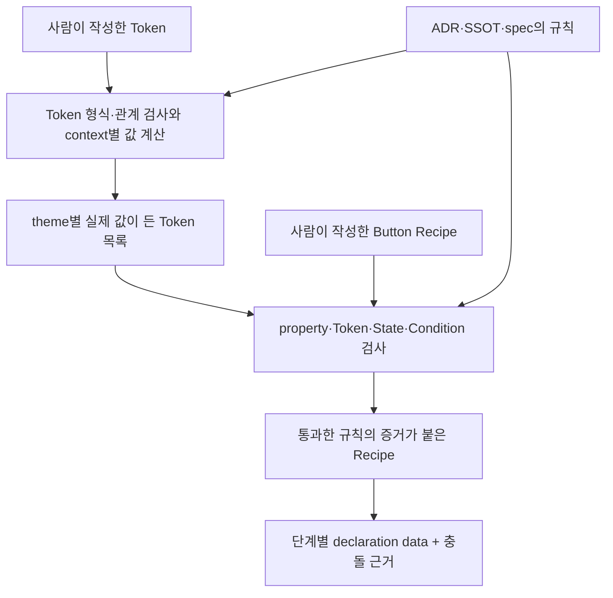

# Axiom Guidebook

> 이 문서는 Axiom을 처음 읽는 기여자를 위한 학습 지도다. 규칙을 새로 정하는 문서가
> 아니며, 실제 권한은 ADR, SSOT, `spec/`, 고정된 검증 사례(fixture), source에서 생성된
> contract 순서로 확인한다.
> 이 문서가 그 자료와 다르면 Guidebook을 믿고 진행하지 말고 충돌을 보고한다.

## 이 문서를 사용하는 네 가지 방법

처음부터 모든 파일을 외울 필요는 없다. 지금 하려는 일에 맞는 부분부터 읽는다.

| 지금 궁금한 것 | 읽을 곳 | 읽은 뒤 할 수 있어야 하는 일 |
| --- | --- | --- |
| Axiom이 무엇을 만드는가 | Part I | Button 값 하나가 현재 결과까지 이동하는 과정을 설명한다. |
| 무엇을 어디서 바꾸는가 | Part II | 원본과 generated file을 구분하고 올바른 검증 명령을 고른다. |
| 왜 이런 경계가 있는가 | Part III | `contract`, `registry`, `manifest`, `IR`이 서로 다른 이유를 설명한다. |
| 특정 파일/API가 무엇을 하는가 | Part IV | 10개 package와 95개 검증 대상 module에서 구현 위치를 찾는다. |

이 문서가 가정하는 독자는 JavaScript object, TypeScript type/interface, 함수와 module,
JSON, `package.json`, `pnpm` 명령을 읽을 수 있다. 디자인 Token, 기계가 읽는 데이터
규칙, 여러 단계의 변환, 중간 산출물은 처음 접할 수 있다고 가정한다. 설명은 한국어로 하고 실제로
검색해야 하는 identifier와 path는 원문을 유지한다.

상태 표현은 세 가지로 고정한다.

- **current**: 현재 N0–N24 코드와 검증에서 실행되는 동작
- **planned**: SSOT에 순서가 있지만 아직 현재 package가 제공하지 않는 동작
- **historical**: 당시 판단을 기록하지만 현재 규칙을 소유하지 않는 자료

# Part I — Axiom을 이해하는 한 경로

## 1. Axiom은 아직 UI component library가 아니다

버튼을 만드는 일은 JSX와 CSS를 작성하는 것으로 끝나지 않는다. 다음 질문에 여러
package가 서로 다른 답을 갖기 시작하면 component 수가 늘수록 결과를 믿기 어렵다.

- 브랜드 배경색은 어떤 이름으로 부르고 light/dark에서 어떤 값이 되는가?
- `backgroundColor`에 아무 Token이나 넣어도 되는가?
- `pressed`와 `reducedMotion`은 같은 종류의 조건인가?
- 두 선언이 같은 CSS property를 덮으면 어떤 선언이 이기는가?
- 생성된 파일이 어떤 원본과 규칙으로 만들어졌는가?

Axiom의 현재 결과는 브라우저에 그려진 Button이 아니다. 사람이 작성한 의도와 저장된
규칙을 검사하여, 다음 단계가 신뢰할 수 있는 **검증된 중간 결과**를 만드는 토대
(Foundation)다. N24에서 Button에 대해 현재 얻는 대표 결과는 다음과 같다.

1. light/dark별로 실제 값이 채워진 Token 목록
2. 사용할 수 있는 CSS property와 Token 연결 규칙표
3. 어떤 규칙을 통과했는지 증거가 붙은 Recipe
4. 적용 단계 순서가 명시된 declaration data와 별도의 충돌 근거
5. 시간에 따른 변화가 검증되어 기록된 data

뒤에서는 이 결과를 각각 resolved manifest, Recipe receipt, Appearance IR,
collision trace, Motion IR이라는 실제 이름으로 연결한다. 지금은 이름보다 “의도와 규칙을
검사해 다음 단계용 data를 만든다”는 관계만 기억하면 된다.

최종 CSS text, class name, DOM, React component는 아직 current 결과가 아니다. Web
compiler는 N29, Motion runtime backend와 React용 결과 변환은 그 뒤의 planned 작업이다.

### 왜 component보다 contract가 먼저인가

TypeScript 함수 `saveUser(input): Result`를 여러 팀이 호출한다고 생각해 보자. 구현보다
먼저 입력, 출력, 오류가 합의되어야 호출자가 안전하게 작업할 수 있다. Axiom에서
계약(`contract`: 다른 module이 의존해도 되는 입력·출력·오류·호환 규칙의 경계)이 먼저인
이유도 같다. Token, component 상태(State), 환경 조건(Condition), Appearance의 모양과
실패 조건을 먼저 고정해야 이후
compiler와 runtime이 서로 다른 해석을 하지 않는다.

비유의 한계도 있다. 일반 함수 type은 주로 한 호출 경계를 설명하지만 Axiom contract는
기계가 읽는 모양 규칙, 등록 목록, 통과·실패 사례, generated TypeScript가 함께 한 경계를
증명한다.

**기억할 것**

- Axiom의 현재 산출물은 UI가 아니라 검증된 Foundation artifact다.
- contract-first는 구현을 미루는 뜻이 아니라 여러 구현이 공유할 경계를 먼저 고정한다는 뜻이다.
- N24 결과와 N29 이후 planned 결과를 한 pipeline처럼 말하면 안 된다.

확인 질문: 지금 `docs/guidebook.md`만 보고 “Axiom이 CSS를 생성한다”고 말하면 왜 틀린가?

## 2. package 이름을 빼고 보는 전체 시스템

먼저 구현 이름을 가리고 값이 어디서 어디로 이동하는지만 본다. 아래 그림은 두 입력
흐름이 검증된 Appearance 결과에서 만나는 과정을 보여준다.



그림은 위에서 아래로 읽는다. 각 화살표가 의미하는 실제 입력, 작업, 출력, 실패는 다음과
같다.

| 화살표 | 들어오는 값 | 하는 일 | 나가는 값 | 실패 예 |
| --- | --- | --- | --- | --- |
| Token → 계산 | `$value`와 `$type`이 있는 JSON | ID, type, unit, alias 관계를 검사한다. | 정규화된 Token record | 중복 ID, 지원하지 않는 unit |
| 규칙 → 계산 | Token 값 범주(Domain)·의미 층(tier)·계산 환경(context) 규칙 | context override를 합치고 `{target.id}`를 조회한다. | light/dark별 concrete value | 없는 target, alias cycle |
| Token 목록 → Recipe 검사 | context마다 완성된 Token entry | property가 그 Token 값 범주를 허용하는지와 실제 CSS 문법을 검사한다. | Token 연결 evidence | `space` Token을 `background-color`에 직접 사용 |
| Recipe → 통과 증거 | slot·variant·state·condition별 선언 | 구조와 모든 authority content 지문(digest)을 다시 확인한다. | frozen `DefinedCSSRecipe` | stale registry content |
| 통과 증거 → declaration data | 검증된 선언과 property 관계 | key를 표준으로 고정한 CSS 이름(canonical name)으로 바꾸고 순서를 보존하며 충돌을 분석한다. | `CSSAppearanceIR`, `CollisionTrace` | reset-longhand 충돌 |

여기서 authority는 “누가 더 중요해 보이는가”가 아니라, 어떤 파일이 어떤 결정을 최종으로
소유하는지를 뜻한다. 진실의 원천(`source of truth`: 충돌 시 최종 판정이 시작되는 자료)은
하나의 파일 이름이 아니라 정해진 우선순위다. [문서 index](README.md)의 Authority Order가
그 순서를 소유한다.

**기억할 것**

- Token Foundation 흐름과 Recipe 소비 흐름은 별개로 시작해 N21 검사에서 만난다.
- 모든 화살표에는 구체적인 전후 값과 실패 경계가 있다.
- package graph는 이 값 흐름을 구현에 배치한 지도이지, 값 흐름 자체가 아니다.

확인 질문: resolved Token manifest가 없으면 Recipe 검사가 확정할 수 없는 두 가지는 무엇인가?

## 3. 실제 Button 배경색 하나를 끝까지 따라가기

이제 같은 흐름에 실제 값을 넣는다. 이 사례는 두 관점을 의도적으로 구분한다.

- Foundation 관점(Token 규칙을 계산하는 경로): public Component Token이 Semantic Token을
  거쳐 primitive 값으로 간다.
- N24 fixture 관점: 현재 Button Recipe는 Component Token이 아니라 Semantic Token을 직접 쓴다.

두 경로를 억지로 하나라고 쓰지 않는 것이 중요하다.

### 3.1 사람이 쓴 값은 아직 색상 하나가 아니다

먼저 무엇을 관찰할지 정한다. `$value`가 실제 색 object인지, 다른 Token ID를 감싼
문자열인지 본다.

**실제 값에 기반한 단순화한 표현 — 실제 `tokens/base.tokens.json`은 중첩 구조**

```json
{
  "color.component.button.root.background.default": {
    "$type": "color",
    "$value": "{color.semantic.fill.brand.default}"
  },
  "color.semantic.fill.brand.default": {
    "$type": "color",
    "$value": "{color.primitive.brand.600}"
  },
  "color.primitive.brand.600": {
    "$type": "color",
    "$value": {
      "colorSpace": "oklch",
      "components": [0.514676, 0.228711, 272.806],
      "alpha": 1,
      "hex": "#444ce7"
    }
  }
}
```

실제 파일은 중첩 JSON이지만 읽기 쉽게 ID를 key처럼 펼쳐 적었다. 첫 두 `$value`는
색상이 아니라 별칭(`alias`: 다른 Token의 값을 쓰겠다는 연결)이다. Axiom에서 Token
참조(`reference`)는 JavaScript object reference나 메모리 주소가 아니다.
`"{color.semantic.fill.brand.default}"`처럼 **중괄호 안에 대상 Token ID가 든 문자열**이다.

세 record의 역할은 다르다.

| Token | tier | 답하는 질문 |
| --- | --- | --- |
| `color.primitive.brand.600` | primitive | 브랜드 팔레트의 600 값은 수치로 무엇인가? |
| `color.semantic.fill.brand.default` | semantic | 기본 브랜드 채움이라는 제품 의미에 어떤 primitive를 배정하는가? |
| `color.component.button.root.background.default` | component | Button root의 기본 배경 역할에 어떤 semantic 의미를 배정하는가? |

tier는 의미 재사용의 층이다. 참조 방향도 제한한다. base Component Token은 Semantic
Token을 직접 가리켜야 하고, Semantic Token은 Primitive 또는 Semantic Token을 가리킬 수
있다. 이 규칙은 [SSOT-01](ssot/01-foundation-and-domain-contracts.md)과 Token schema가
소유한다.

결과: source에는 “Button 배경은 브랜드 채움 의미를 사용한다”는 의도와 “그 의미의 현재
수치는 무엇이다”라는 값이 분리되어 있다. 그래서 팔레트 값이 바뀌어도 Button source를
일일이 수정하지 않는다.

### 3.2 parser와 adapter가 외부 모양을 Axiom record로 바꾼다

JSON text는 그 자체로 Axiom 내부 계약이 아니다. 먼저 외부 parser가 DTCG 문서를 읽는다.
parser(`parser`: text/file 형식을 읽어 구조화된 값으로 만드는 도구)는
`@terrazzo/parser`다. Axiom은 그 package가 돌려준 vendor object를 repository 전체로
퍼뜨리지 않는다.

`TerrazzoTokenParser`가 adapter(`adapter`: 외부 모양을 Axiom 경계의 모양으로 바꾸는
변환기) 역할을 한다. `normalizeToken`은 다음처럼 여러 외부 표현을 하나의 record로
정규화한다. 정규화(`normalize`: 허용된 여러 표현을 이후 단계가 다룰 한 가지 모양으로
맞추는 일)는 아직 alias의 최종 값을 계산하는 일이 아니다.

| 전 | 검사·변환 | 후 |
| --- | --- | --- |
| Terrazzo `TokenNormalized` | ID를 `domain.tier.path`로 분해 | `domain: "color"`, `tier: "semantic"` |
| `$value` | JSON으로 복제 가능한지 검사 | 함수·class instance가 없는 `TokenJsonValue` |
| `"{...}"` | 정규식으로 대상 ID 추출 | `aliasTarget`과 원래 `value` |
| parser source 정보 | filename과 JSON pointer만 보존 | `{ file, pointer }` |

JSON-safe는 `JSON.stringify`와 `JSON.parse`를 통과해도 의미가 보존되는 data라는 뜻이다.
함수, `Map`, class instance는 이 경계를 통과하지 않는다. 결과 record가
`ParsedDtcgToken`이라는 이름을 쓰는 이유는 파일을 읽었고 Axiom 모양으로 맞췄지만 아직
context별 alias 계산은 하지 않았기 때문이다.

여기서 `source`는 값이 출발한 파일·위치이고, `target`은 alias가 도달하려는 Token ID다.
일반 영어와 달리 방향을 추적하는 field 이름으로 쓰이므로 둘을 바꾸면 diagnostic도 반대로
읽게 된다.

### 3.3 resolver는 문자열 target을 Map에서 찾는다

이 단계에서 관찰할 값은 `current.value`, 중괄호에서 꺼낸 `targetId`, 그리고
`Map.get(targetId)`의 결과다.

**단순화한 예시 — 실제 API가 아니라 `context-resolver.ts`의 핵심 동작만 표현**

```ts
const byId = new Map(tokens.map((token) => [token.id, token]));

function resolveToken(id: string) {
  const token = byId.get(id);
  const targetId = readAliasTarget(token.value);
  return targetId === undefined ? token.value : resolveToken(targetId);
}
```

1. 모든 parsed Token을 `Token ID → Token record` Map으로 만든다.
2. `resolveToken("color.component.button.root.background.default")`를 호출한다.
3. 현재 `$value`에서 `color.semantic.fill.brand.default`를 꺼내 Map을 다시 조회한다.
4. 다시 `color.primitive.brand.600`을 조회한다.
5. 참조 문자열이 아닌 OKLCH object에 도착하면 그 값을 반환한다.

실제 구현은 이보다 더 많은 일을 한다. 조회 전에 unknown target, 금지된 tier edge,
Domain/type 불일치와 cycle을 검사한다. 계산 중에는 cache를 써서 같은 ID를 반복 계산하지
않고, object 안에 포함된 참조도 재귀적으로 해결한다. 구현은
`packages/tokens/src/resolution/context-resolver.ts`의 `validateGraph`, `resolveGraph`,
`resolveTokenContexts`에 있다.

결과는 단순한 색 문자열이 아니라 다음 정보를 가진 resolved entry다.

| field | 이 사례의 값 | 필요한 이유 |
| --- | --- | --- |
| `id` | `color.component.button.root.background.default` | 어떤 Token 결과인지 찾는다. |
| `domain` | `color` | 이후 CSS binding 호환성을 판정한다. |
| `tier` | `component` | 의미 계층을 보존한다. |
| `dtcgType` | `color` | 값 구조를 검사한다. |
| `resolvedValue.hex` | `#444ce7` | CSS 문법 검사에 쓸 문자열을 만들 수 있다. |
| `dependencies` | `color.semantic.fill.brand.default` | 직접 의존 관계를 추적한다. |
| `source` | base file과 pointer | 결과가 어디서 왔는지 찾는다. |

### 3.4 light와 dark는 tier가 아니라 계산 조건이다

Theme을 Token 이름에 별도 tier로 넣지 않는다. context(`context`: 같은 의도를 어떤 환경
조건에서 계산하는지를 나타내는 입력)가 먼저 base record 위에 override를 합친다.

1. `resolver-modifier-registry.json`이 `theme: light | dark` 조합을 요구한다.
2. 각 theme document는 기존 Semantic 또는 Component Token의 값만 바꿀 수 있다.
3. Primitive Token은 context에서 바꿀 수 없다.
4. 합쳐진 각 Map을 따로 resolve한다.

Modifier는 Token 이름을 바꾸는 문자열 조각이 아니다. resolver가 지원하는 계산 축과 허용
값을 등록한 정의다. 현재 modifier는 `theme`이고 값은 `light`, `dark`다. context는 그
축에서 고른 한 조합, 예를 들어 `{ theme: "dark" }`다.

이 Button brand default는 light와 dark 모두 우연히 `#444ce7`이다. 이것은 context가 쓸모
없다는 뜻이 아니다. 다른 Semantic Token은 context에 따라 다른 primitive를 가리킬 수
있다. “resolver가 dark를 적용하면 반드시 값이 달라진다”가 아니라 “dark에서 사용할
record를 먼저 합성한 뒤 그 graph를 계산한다”가 정확하다.

### 3.5 manifest는 계산 결과의 운송 상자다

manifest(`manifest`: 한 처리 결과에 무엇이 들어 있는지 다른 단계가 읽을 수 있게 나열한
serializable inventory)는 source Token을 대체하지 않는다. 이 사례에서
`foundation-resolved-token-manifest.json`은 light와 dark context마다 정렬된 resolved
entry를 담는다.

`serializeResolvedTokenManifest`는 object key와 Token을 안정된 순서로 정렬해 JSON text로
바꾼다. 직렬화(`serialize`: 메모리 값을 저장하거나 전달할 표현으로 바꾸는 일)는 여기서
**manifest object → JSON string**을 뜻한다. 이때의 serializer와 뒤에서 나오는
`css.color.v1`은 이름이 비슷하지만 목적과 입력이 다르다.

| 이름 | 입력 | 출력 | 사용 시점 |
| --- | --- | --- | --- |
| `serializeResolvedTokenManifest` | resolved manifest object | deterministic JSON text | generated manifest 검사/쓰기 |
| `css.color.v1` serializer port | `ResolvedTokenEntry` | `#444ce7` 같은 CSS value string | Recipe Token binding의 문법 검사 |
| `serializeAppearanceIR` | Appearance IR object | canonical JSON text | IR 비교/전달 |

### 3.6 Domain은 값 범주이고 registry는 허용 관계표다

Domain은 결제나 배송 같은 business domain이 아니다. Axiom의 Token Domain은 “이 Token이
어떤 종류의 디자인 값을 나타내며 어디에 연결될 수 있는가”를 구분하는 값 범주다. Token
ID의 첫 segment가 `color`이므로 parser는 이 record에 `domain: "color"`를 기록한다.

`spec/token/token-domain-registry.json`의 `color` row는 다음 사실만 선언한다.

| field | 값 | 뜻 |
| --- | --- | --- |
| `id`, `root` | `color` | Token ID의 첫 segment와 일치해야 한다. |
| `allowedDTCGTypes` | `["color"]` | `$type: "color"`만 이 Domain에 들어온다. |
| `cssSerializers` | `["css.color.v1"]` | CSS 검사가 필요할 때 이 ID의 실행 port를 찾을 수 있다. |

registry(`registry`: 허용된 identity와 그 identity의 규칙을 안정된 key로 조회하게 하는
목록)는 함수를 실행하지 않는다. `cssSerializers`에 문자열 ID가 있다는 사실과 실제
`serialize(entry)` 함수가 주입되었다는 사실은 별도다. N21은 둘이 맞는지 검사한다.

DTCG type과 Domain도 같은 개념이 아니다. 둘 다 dimension 모양을 쓰더라도 `space`는 CSS
간격에 쓸 수 있고 `breakpoint`는 Condition threshold로만 쓴다. 값 모양만으로 사용 목적을
결정하면 breakpoint가 임의의 padding 값으로 새어 나갈 수 있다.

### 3.7 Webref, sparse policy, binding catalog가 한 property row를 만든다

`backgroundColor`를 허용하려면 서로 다른 세 질문에 답해야 한다.

| 자료 | 소유하는 질문 | `background-color`에서 주는 답 |
| --- | --- | --- |
| pinned Webref | 이 CSS property의 표준 이름과 grammar는 무엇인가? | name은 `background-color`, syntax는 `<color>` |
| sparse property policy | Axiom authoring에서 Token이 아닌 직접 CSS 값(raw CSS), shorthand, motion 등을 어떻게 다루는가? | paint group의 정책을 적용 |
| Token Binding Catalog | 어떤 Domain을 어떤 방식으로 연결할 수 있는가? | `color`를 전체 값(direct) 또는 일부 조합(template)으로 허용 |

pinned(`pin`: 검토한 외부 입력의 version·path·content identity를 고정한 상태) Webref는 웹
표준 사실을 제공한다. sparse는 “대부분은 기본값을 쓰고 다른 항목만 기록한다”는 뜻이다.
따라서 sparse policy에 row가 없다고 property가 미지원인 것은 아니다.

`generatePropertyProfile`은 Webref property마다 status default → group patch → property
override → Token binding → blocked property 순서로 규칙을 합친다. `default`는 더 구체적인
선택이 없을 때 적용되는 값이고, `override`는 더 구체적인 규칙이 앞의 값을 교체한다는
뜻이다. 이 계산이 끝난 값을 effective policy라고 부른다.
effective(`effective`: 여러 기본값과 override가 모두 적용된
뒤 실제 판정에 쓰이는 최종값)는 source policy 한 줄과 동일하지 않을 수 있다.

여기서 policy는 막연한 운영 방침이 아니라 validator와 generator가 읽어 실제 허용/차단을
결정하는 Axiom 규칙 data다. 이 규칙과 Webref capability를 target별로 묶은 것이 CSS
Appearance Profile이다.

결과 `effective-property-registry.json`의 `background-color` row에는 다음이 함께 있다.

- authoring name `backgroundColor`와 canonical name `background-color`
- syntax `<color>`
- current authoring/security/motion policy
- direct `color` Domain binding
- 어떤 source rule이 적용됐는지 나타내는 provenance

provenance(`provenance`: 결과가 어떤 입력과 규칙에서 만들어졌는지 되짚는 근거)는 주석이
아니다. 충돌 분석과 stale authority 검사가 실제로 소비한다.

### 3.8 serializer는 N21 검사 중에만 실행된다

이제 사용자가 가장 헷갈리기 쉬운 연결을 실행 순서로 고정한다.

1. Recipe declaration의 `backgroundColor`를 registry에서 `background-color`로 바꾼다.
2. Token reference `color.semantic.fill.brand.default`를 resolved manifest index에서 찾는다.
3. 모든 context에 entry가 있고 `domain`, `tier`, `dtcgType`이 변하지 않는지 검사한다.
4. effective property policy가 `background-color + direct + color`를 허용하는지 검사한다.
5. Domain registry의 `cssSerializers`에서 `css.color.v1` ID를 읽는다.
6. 주입된 serializer port 중 같은 ID의 함수를 찾는다.
7. 각 context의 `ResolvedTokenEntry`를 함수에 넣어 `#444ce7` 문자열을 얻는다.
8. `CSSGrammarValidator`가 그 문자열을 `background-color`의 grammar와 대조한다.
9. 통과하면 receipt에 Token ID, Domain, DTCG type, serializer ID를 증거로 남긴다.

중요한 경계: `#444ce7`은 **검사용 임시 문자열**이다. 현재 Appearance IR에는 원래
`{ kind: "token", path: "color.semantic.fill.brand.default" }`가 보존된다. serializer가
CSS file을 쓰거나 class name을 만들거나 DOM에 style을 적용하지 않는다.

실패 예를 보면 책임이 더 선명하다.

| 실패 | 발견 위치 | 대표 diagnostic |
| --- | --- | --- |
| Token ID가 context 하나에 없음 | manifest index/authoring validation | `AXT1501`, Token unresolved |
| Domain에 실행 serializer port가 없음 | `serializerFor` | `AXP1104` |
| `space`를 `background-color`에 direct binding | Token binding policy | `AXP1103` |
| serializer가 만든 문자열이 `<color>`가 아님 | CSS grammar validator | `AXP1201` |

### 3.9 현재 Button fixture는 Semantic Token을 직접 쓴다

이제 실제 소비 source에서 무엇을 관찰할지 정한다. `backgroundColor`의 value가 앞의
Component Token인지 Semantic Token인지 본다.

**실제 Axiom code — `fixtures/button/appearance.ts`의 brand variant**

```ts
brand: {
  root: {
    backgroundColor: {
      kind: "token",
      path: "color.semantic.fill.brand.default"
    }
  }
}
```

현재 fixture는 `color.component.button.root.background.default`를 쓰지 않는다. Foundation에
그 Component Token이 존재하고 같은 색으로 resolve된다는 사실과 N24 Button conformance가
그 경로를 소비한다는 주장은 다르다. Guidebook은 전자는 설명하지만 후자를 만들어내지
않는다.

`createCSSRecipeAuthoring(...).defineRecipe(...)`는 Kernel 구조, property, raw CSS grammar,
State/Condition, Token authority와 digest를 검사하고 frozen `DefinedCSSRecipe` receipt를
반환한다. receipt는 “이 정의가 이 정확한 authority set을 통과했다”는 증거다.

### 3.10 normalizer가 선언을 IR로 낮추고 현재 흐름은 멈춘다

IR(`intermediate representation`: 다음 단계가 source 문법을 다시 해석하지 않도록 의미를
명시한 중간 데이터)은 source를 예쁘게 복사한 object가 아니다. normalizer는 다음을 한다.

- `backgroundColor`를 canonical `background-color`로 바꾼다.
- base → variant → state → compound → condition stage를 분리해 순서를 보존한다.
- declaration마다 `recipeId`, slot, source pointer, stage를 origin으로 남긴다.
- shorthand/longhand, reset, 같은 property, condition overlap을 별도 trace로 분석한다.
- receipt가 현재 주입된 authority digest와 맞는지 새로 검증한다.

이 사례의 golden IR에서 관찰할 값은 property 이름과 Token reference가 어떻게 달라졌는지다.

**축약한 실제 Axiom generated evidence — 필요한 field만 발췌**

```json
{
  "property": "background-color",
  "value": {
    "kind": "token",
    "path": "color.semantic.fill.brand.default"
  },
  "origin": {
    "recipeId": "button",
    "slot": "root",
    "stage": "variant",
    "source": "fixtures/button/appearance.ts#/variants/tone/brand/root/backgroundColor"
  }
}
```

결과에서 camelCase property는 canonical CSS 이름으로 바뀌었지만 Token은 `#444ce7`로
치환되지 않았다. 이 보존 덕분에 planned compiler가 theme과 output 전략을 결정할 여지가
남고 provenance도 잃지 않는다. N24 current pipeline은 Appearance IR, collision trace,
Motion IR과 Button conformance evidence에서 멈춘다.

**Button 경로 요약**

```text
Foundation source
color.component.button.root.background.default
→ color.semantic.fill.brand.default
→ color.primitive.brand.600
→ light/dark resolvedValue.hex = #444ce7

N24 consumer source
backgroundColor + color.semantic.fill.brand.default
→ property/Domain/serializer/grammar validation
→ frozen binding receipt
→ background-color + preserved Token reference in Appearance IR
→ no final CSS emission yet
```

위 요약은 두 source 경로가 N21에서 같은 resolved authority를 공유한다는 뜻이지, Button
fixture가 Component Token을 직접 통과한다는 뜻은 아니다.

**스스로 설명해 보기**

1. 중괄호 Token reference에서 target ID를 꺼낸 뒤 어떤 자료구조를 조회하는가?
2. `Domain`과 `$type`이 둘 다 필요한 이유는 무엇인가?
3. `css.color.v1`이 실행되는 정확한 시점과 입출력은 무엇인가?
4. 왜 IR에는 `#444ce7` 대신 Token reference가 남는가?

## 4. 이 값 흐름을 구현 package에 배치하기

이제야 package 이름을 붙인다. 화살표 방향은 runtime/import dependency 방향이며, authority
우선순위를 뜻하지 않는다.

| package | 값 흐름에서 맡는 경계 | 받는 것 → 내는 것 | 하지 않는 일 |
| --- | --- | --- | --- |
| `@axiom/tokens` | target-neutral Token identity와 resolution | parsed Token + contexts → resolved manifest | DTCG file parsing, CSS, React |
| `@axiom/token-tooling` | 외부 Token source adapter와 Foundation generation | DTCG files → parsed records/generated artifacts | vendor object를 public contract로 노출 |
| `@axiom/css-property-profile` | Web CSS capability와 policy | pinned Webref + sparse rules → effective registry | Token graph resolve, CSS emission |
| `@axiom/condition-registry` | registered Condition 관계 분석 | expression + registry + thresholds → satisfiability/relation | browser 상태 읽기 |
| `@axiom/behavior-contracts` | generated behavior type surface | normative schema → TypeScript types | runtime behavior 구현 |
| `@axiom/recipe-kernel` | renderer-neutral Recipe 구조 | definition → frozen structural snapshot | CSS/Token 의미 검사 |
| `@axiom/appearance-authoring` | CSS-aware Recipe authoring | definition + authorities → validated receipt | Appearance IR 생성 |
| `@axiom/appearance-normalizer` | source를 canonical IR로 lowering | authenticated receipt → Appearance IR + trace | CSS/class 방출 |
| `@axiom/motion-schema` | Appearance/Motion generated types와 Motion authoring | motion definition + authorities → Motion IR | runtime animation 실행 |
| `@axiom/spec-tooling` | repository의 normative spec harness | manifest + schemas + fixtures → report/generated contracts | runtime package의 authority가 되기 |

분리 기준은 “파일이 많아서”가 아니다. 외부 parser가 바뀌어도 target-neutral Token
contract가 흔들리지 않아야 하고, spec generator가 runtime package에 역으로 import되면
안 되며, Recipe structure와 CSS policy는 서로 다른 authority를 가진다. 실제 허용 import는
[implementation architecture](architecture.md)와 `scripts/check-boundaries.mjs`가 검사한다.

### public API와 internal module

각 package의 `src/index.ts`가 entrypoint(`entrypoint`: 다른 package가 들어올 수 있도록
공식적으로 연 문)다. 파일이 `src/`에 있다고 모두 public API는 아니다. 다른 package는
상대 경로로 내부 파일을 찌르지 않고 package export를 통해서만 의존한다.

`contracts.ts`는 입력·출력·error shape를 모으는 경계이고, `constants.ts`는 package-wide
protocol과 diagnostic identity의 owner이며, generated file은 source schema/registry의
projection이다. projection(`projection`: 원본의 일부 의미를 다른 소비 형식으로 옮긴 결과)은
새 authority가 아니다.

확인 질문: 외부 DTCG parser 교체가 `@axiom/tokens`의 public contract 변경으로 곧바로
이어지지 않아야 하는 이유는 무엇인가?

## 5. State, Condition, context, variant는 서로 다른 축이다

이름이 비슷한 “조건”을 한 object에 섞으면 누가 값을 공급하고 언제 평가하는지 알 수 없다.

| 축 | 질문 | Button 사례 | owner |
| --- | --- | --- | --- |
| variant | 사용자가/호출자가 어떤 디자인 선택을 했는가? | `tone: brand` | Recipe definition |
| State | component behavior가 현재 어떤 상태인가? | `pressed: true` | canonical state registry + behavior projection |
| Condition | 어떤 환경 규칙이 참인가? | `preference.reducedMotion` | condition registry |
| Token context | 같은 Token 의도를 어떤 계산 환경에서 resolve하는가? | `theme: dark` | resolver modifier registry |
| Motion phase | 시간에 따라 어떤 전이가 진행되는가? | `stateChange`, `enter`, `exit` | Motion authoring/IR |

State는 `pressed`, `open`, `disabled`처럼 component의 의미 상태다. Condition은 viewport,
container, reduced-motion처럼 환경을 나타낸다. Token context는 source graph를 계산할 때 쓰고,
Appearance Condition은 declaration 적용 가능성을 표현한다. 서로 문자열처럼 보인다는 이유로
같은 registry나 lifecycle로 합치지 않는다.

N24 Button fixture는 variant, pressed State, reduced-motion Condition, Token binding과 Motion을
한 conformance proof에서 함께 확인한다. React Aria runtime이 실제 state를 공급하는 일은
planned다.

확인 질문: `theme: dark`와 `pressed: true`는 각각 어느 단계의 입력이며, 왜 같은
registry에 들어가지 않는가?

## 6. schema, validation, fixture를 한꺼번에 부르지 않기

회원가입 form을 생각하면 차이가 쉽다. form field 규칙은 실제 제출 값이 아니고, TypeScript
type이 있다고 서버로 들어온 JSON이 자동으로 안전해지는 것도 아니다.

| 개념 | Axiom에서의 정확한 역할 | 보장하지 않는 것 |
| --- | --- | --- |
| JSON | data를 저장/전달하는 text 형식 | 값이 올바르다는 보장 |
| JSON Schema | required field, type, enum, conditional shape를 기계가 검사하는 규칙 | cross-file 의미와 graph 규칙 전부 |
| TypeScript type | compile time에 작성자와 소비자가 쓰는 shape | runtime JSON의 진위 |
| schema validation | 한 value가 선언된 구조와 맞는지 검사 | alias cycle, digest 일치 같은 의미 관계 |
| semantic validation | 여러 field/file 사이의 Axiom 규칙 검사 | UI runtime 동작 |
| fixture | 통과하거나 실패해야 하는 구체 사례 | 규칙 자체의 authority |

fixture(`fixture`: 같은 검사를 반복 재현하기 위해 고정한 입력 사례)는 positive와 negative가
짝을 이룬다. positive만 있으면 허용 경계는 보이지만 무엇을 거부해야 하는지 증명하지 못한다.
`@axiom/spec-tooling`은 `spec/manifest.json`에서 schema, registry, fixture suite와 semantic
validator dispatch를 읽어 구조 검사와 의미 검사를 모두 실행한다.

diagnostic은 단순 message string이 아니라 `code`, `severity`, `phase`, `source`, `target` 등을
가진 실패 data다. 따라서 CI와 개발자가 같은 실패를 안정적으로 분류할 수 있다.

확인 질문: JSON Schema를 통과한 Condition registry가 semantic validation에서 여전히 실패할
수 있는 사례를 하나 들어보자.

**Part I을 마치며 답할 수 있어야 하는 것**

- Axiom이 component library보다 contract와 Foundation을 먼저 만드는 이유
- authored Token에서 resolved manifest까지 값이 바뀌는 단계
- Token reference의 실제 문자열 표현과 Map lookup
- tier, Domain, DTCG type, context의 차이
- Webref, sparse policy, binding catalog, effective registry의 역할 분리
- CSS serializer의 선택 시점, 입력, 출력, 비-emission 경계
- Recipe receipt와 Appearance IR이 다른 이유
- schema, TypeScript type, runtime/semantic validation, fixture의 차이
- 10개 package가 나뉜 책임과 public entrypoint
- current N24와 planned N25+/N29+ 경계

# Part II — Axiom에서 안전하게 작업하기

## 7. 먼저 원본과 결과를 구분한다

편집 전에 “내가 바꾸려는 결정을 누가 소유하는가?”를 묻는다. generated artifact를 직접
고치면 다음 generation에서 사라지고 provenance도 거짓이 된다.

| 하고 싶은 일 | 먼저 읽을 authority | 편집하는 source | 직접 편집하지 않는 결과 |
| --- | --- | --- | --- |
| Token 값/경로 변경 | ADR-0004, SSOT-01, Token schemas | `tokens/*.tokens.json`과 필요 시 owning policy | resolved manifest, generated token paths |
| semantic vocabulary 변경 | SSOT-01, semantic vocabulary schema | `spec/token/semantic-token-vocabulary.json` + Token source | generated types |
| CSS property policy 변경 | ADR-0001, SSOT-03 | sparse policy 또는 binding catalog | effective registry, CSS property names |
| State/Condition 변경 | SSOT-04/05 | owning registry와 schema/fixtures | generated reference contracts |
| Recipe authoring 변경 | ADR-0003, SSOT-03 | authoring source와 관련 contract/tests | normalized golden output |
| spec contract 변경 | owning SSOT + schema | schema, manifest, positive/negative fixtures | generated contract package files |

Owner-approved 구조 변경이 stale SSOT와 충돌하면 구현으로 몰래 우회하지 않는다. 먼저 ADR
decision과 owning SSOT를 맞춘 뒤 downstream schema, fixture, generated contract,
implementation을 순서대로 갱신한다.

## 8. Token을 추가하거나 변경하기

### 언제 하는가

새로운 재사용 값이나 의미 역할이 실제 제품 요구로 생겼고 기존 Token이 그 뜻을 정확히
나타내지 못할 때 한다. CSS 한 줄을 줄이기 위한 이유만으로 public Component Token을 만들지
않는다.

### 작업 순서

1. `docs/ssot/01-foundation-and-domain-contracts.md`에서 tier/Domain 규칙을 확인한다.
2. `spec/token/token-domain-registry.json`에서 Domain과 DTCG type을 확인한다.
3. base 또는 theme source 중 올바른 owner를 고른다. Primitive는 theme override에 두지 않는다.
4. Semantic/Component라면 허용된 tier 방향으로 alias를 건다.
5. production scale이나 semantic family를 바꾸면 Foundation policy/vocabulary와 일치시킨다.
6. generated artifact는 명령으로 갱신한다.

실행할 명령과 관찰할 결과는 다음 순서다.

```bash
pnpm tokens:generate
pnpm tokens:check
pnpm check
pnpm test
pnpm build
```

`tokens:generate`는 resolved manifest와 Token path type을 source에서 다시 만든다.
`tokens:check`는 현재 checked-in 결과와 새 계산이 같은지 검사한다. unknown alias, 금지 tier
edge, missing context, Foundation scale 위반이 나오면 diagnostic의 Token ID와 source pointer부터
따라간다.

## 9. CSS property policy나 Token binding을 바꾸기

표준 CSS property 존재 여부, Axiom authoring 정책, Token Domain 호환성을 먼저 구분한다.

1. property 자체의 표준 사실이 바뀌었다면 pinned Webref update 절차가 필요하다.
2. 공통 authoring/security/motion 정책을 바꾸면 `sparse-property-policy.json`의 group/default를 본다.
3. 한 property만 예외라면 override를 쓴다.
4. Token Domain의 direct/template/projector 연결을 바꾸면 `token-binding-catalog.json`을 고친다.
5. Domain 또는 projector identity가 registry에 존재하는지 확인한다.
6. positive와 negative fixture/test로 허용과 거부를 함께 증명한다.

결과를 생성하고 검사하는 명령은 다음과 같다.

```bash
pnpm profile:generate
pnpm profile:check
pnpm check
pnpm test
pnpm build
```

`profile:generate`는 effective registry, coverage, generated CSS property type을 갱신한다.
group conflict, unknown Webref property, unknown Domain/projector, authoring-name collision이 대표
실패다. effective registry를 손으로 고쳐 통과시키지 않는다.

## 10. schema, registry, fixture, semantic validator를 추가하기

구조만 검사하면 되는지 cross-file 의미까지 검사해야 하는지 먼저 결정한다.

1. owning SSOT에서 규칙을 확인한다.
2. `*.schema.json`에 JSON 한 개의 구조를 표현한다.
3. 실제 canonical registry/source를 `spec/manifest.json`에 연결한다.
4. 최소 positive fixture와 각 금지 경계를 증명하는 negative fixture를 추가한다.
5. cross-file 규칙이면 `packages/spec-tooling/src/semantic/`에 validator를 두고
   `semantic-validators.ts` dispatch에 연결한다.
6. diagnostic code와 phase를 existing owner에서 재사용하거나 그 owner에 추가한다.
7. generated TypeScript가 필요한 family면 contracts generation을 실행한다.

관찰할 명령은 다음과 같다.

```bash
pnpm spec:check
pnpm contracts:generate
pnpm contracts:check
pnpm check
pnpm test
pnpm build
```

schema에는 맞지만 semantic validator가 실패할 수 있다. 예를 들어 ID field가 모두 string이어도
정렬, 중복, required member coverage, digest 관계가 틀리면 의미 검사가 거부한다.

## 11. generated artifact를 갱신할 때

| artifact family | source owner | write command | drift check |
| --- | --- | --- | --- |
| Token manifest/path types | Token sources + Token policy/registries | `pnpm tokens:generate` | `pnpm tokens:check` |
| CSS registry/property types | Webref pin + sparse policy + binding catalog | `pnpm profile:generate` | `pnpm profile:check` |
| condition/motion/behavior reference types | normative schemas/registries | `pnpm contracts:generate` | `pnpm contracts:check` |

generated artifact(`generated artifact`: source와 generator로 재현되는 결과 파일)는 review 대상이
아닌 것이 아니다. 직접 편집하지 않을 뿐, diff가 source 변화와 일치하는지 검토한다.

## 12. validation failure를 역추적하기

message 전체를 검색하기 전에 phase와 code를 본다.

| 단서 | 먼저 볼 owner | 다음 증거 |
| --- | --- | --- |
| `AXT...`, phase `token` | `@axiom/tokens`, `@axiom/token-tooling` | Token negative fixture와 resolver/parser tests |
| `AXP100...` | CSS property/grammar | `css-grammar-validator.ts`와 property tests |
| `AXP110...` | Token binding policy/serializer | `token-binding-validator.ts`, authoring Token tests |
| Recipe structure code | Recipe Kernel/appearance authoring | definition/validation colocated tests |
| normalization collision code | appearance normalizer/spec semantic validator | collision trace fixture와 golden |
| motion code | motion authoring/spec semantic validator | Motion positive/negative fixtures |
| schema path/AJV error | spec harness | manifest entry, schema, exact fixture |

실패를 좁히는 실제 순서:

1. diagnostic의 `phase`, `code`, `source`, `target`을 기록한다.
2. code constant를 `rg`로 찾아 정적 owner를 찾는다.
3. 같은 code를 기대하는 negative test/fixture를 찾는다.
4. source input과 generated output 중 어느 쪽이 stale인지 digest/provenance로 확인한다.
5. focused test를 실행한 뒤 root gate로 넓힌다.

예를 들어 `AXP1103`이면 resolver를 먼저 고치는 것이 아니다. 이 code는 property와 Domain의
binding 불일치를 뜻하므로 effective property row, binding catalog, Token Domain을 비교한다.

## 13. Button input을 current 결과까지 추적하기

1. `fixtures/button/appearance.ts`에서 declaration과 source path를 찾는다.
2. `authoringNames`에서 camelCase가 어떤 canonical property가 되는지 본다.
3. effective property row의 policy와 Token bindings를 확인한다.
4. resolved manifest의 모든 context에서 Token ID를 찾는다.
5. `tokenBindingReport.bindings`가 serializer ID와 declaration pointer를 보존하는지 본다.
6. normalizer golden에서 canonical property, preserved Token reference, origin을 확인한다.
7. collision trace와 diagnostics가 허용 가능한지 본다.
8. Motion fixture/IR가 같은 Recipe ID와 authority digest를 쓰는지 본다.

현재 마지막 산출물은 normalized evidence다. “브라우저에서 어떤 CSS가 나오는가?”는 N29
compiler가 구현된 뒤에야 이 추적 경로에 추가한다.

## 14. source module을 추가할 때

package boundary와 public 여부를 먼저 결정하고 `constants.ts`, `contracts.ts`, `index.ts`의
owner 역할을 침범하지 않는다. public callable에는 intent를 설명하는 English TSDoc을 붙이고,
test는 colocate한다. 그 다음 Guidebook Part IV에 module entry와 marker를 추가한다.

```bash
pnpm check:standards
pnpm check:boundaries
pnpm guidebook:check
pnpm check
pnpm test
pnpm build
```

`guidebook:check`는 package `src/`의 비-test TypeScript module과 root policy script를 찾아 이
문서의 marker와 비교한다. 현재 baseline은 package module 91개와 script 4개, 총 95개다.

# Part III — 설계 선택을 이해하기

## 15. authority는 문서 종류가 아니라 변경 방향을 정한다

Axiom의 authority order는 다음 방향으로 흐른다.

1. accepted ADR이 architecture 변경을 기록한다.
2. owning SSOT가 system/domain contract를 설명한다.
3. schema, registry, pinned manifest가 기계가 읽는 규칙을 소유한다.
4. fixture와 golden artifact가 구체 사례를 증명한다.
5. generated TypeScript가 그 규칙을 compile-time surface로 projection한다.
6. implementation이 계약을 실행한다.

구현이 테스트를 통과했다고 SSOT를 자동으로 바꾸지는 않는다. 반대로 owner가 아직 release되지
않은 구조를 명시적으로 바꾸면 ADR decision input으로 기록하고 SSOT와 downstream contract를
함께 갱신한다. Guidebook은 어느 방향에도 새 결정을 삽입하지 않는다.

## 16. parse, adapt, normalize, resolve, validate, serialize

이 동사들은 모두 “데이터를 처리한다”로 번역하면 경계가 사라진다.

| 동사 | Button Token에서의 전 값 | 작업 | 후 값 |
| --- | --- | --- | --- |
| parse | DTCG JSON file | syntax/vendor 형식을 읽는다. | Terrazzo object |
| adapt | vendor-specific object | Axiom field와 diagnostic으로 변환한다. | `ParsedDtcgDocument` |
| normalize | 여러 허용 표현 | 한 canonical internal shape로 맞춘다. | JSON-safe Token record |
| resolve | alias와 context override가 남은 graph | target 조회와 context 계산 | concrete `resolvedValue` |
| validate | candidate + rule/authority | 허용 여부를 판정한다. | diagnostics 또는 trusted receipt |
| serialize | in-memory object/value | 전달 가능한 문자열 표현으로 바꾼다. | manifest JSON 또는 CSS 검사 문자열 |
| deserialize | JSON text 같은 전달 표현 | 메모리 object로 읽는다. | 아직 검증되지 않은 parsed value |

canonical(`canonical`: 여러 동등한 표현 중 비교와 downstream 의존에 쓰기로 정한 대표 표현)은
“가장 예쁜 형식”이라는 뜻이 아니다. Axiom에서는 stable sort, kebab-case property, closed
object shape처럼 동일 입력이 동일 결과를 만들게 하는 약속과 연결된다.

deterministic output은 같은 pinned input과 version으로 반복했을 때 byte 또는 semantic output이
같다는 뜻이다. 그래서 object key order, array order, JSON indentation까지 generator가 통제한다.

## 17. schema, registry, manifest, profile

네 명사는 모두 JSON file에 나타날 수 있지만 질문이 다르다.

| 이름 | 핵심 질문 | Button 사례 |
| --- | --- | --- |
| schema | 이 data가 가질 수 있는 shape와 조건은? | resolved entry의 required fields |
| registry | 어떤 identity가 등록되어 있고 무엇을 허용하는가? | `color` Domain, `pressed` State |
| manifest | 이번 artifact set/input set에 무엇이 들어 있는가? | light/dark resolved Tokens, spec inventory |
| profile | 특정 target/환경에서 어떤 capability와 policy를 적용하는가? | `axiom-css` property profile |

profile은 사용자 프로필이 아니다. 같은 renderer-neutral Recipe structure라도 CSS target에서
어떤 property/value를 허용할지 묶은 capability 계약이다. manifest는 그 policy를 계산하지
않고, registry는 한 실행의 산출물 목록을 뜻하지 않는다.

## 18. pin, digest, provenance는 서로 다른 질문에 답한다

| 개념 | 질문 | 실패 사례 |
| --- | --- | --- |
| pin | 어느 package version과 어느 input path를 읽기로 했는가? | installed Webref version이 `8.7.3`이 아님 |
| digest | 실제 bytes/canonical data가 검토한 내용과 같은가? | version은 같지만 `css.json` content가 다름 |
| provenance | 어떤 source rule들이 이 final row에 적용됐는가? | stale policy로 만든 collision evidence |

digest(`digest`: 입력을 고정 길이 fingerprint로 요약한 값)는 내용을 복원하지 않는다. equality를
빠르고 안정적으로 비교한다. `sha256:...`만 같다고 두 자료의 의미까지 저절로 같아지는 것은
아니므로 schema/profile identity와 함께 검사한다.

## 19. raw, authored, normalized, resolved, effective, generated

| 상태 | 아직 남아 있는 일 |
| --- | --- |
| raw input | parsing, trust 검사가 안 됐을 수 있다. |
| authored source | 사람이 의도를 썼지만 아직 전체 authority를 통과하지 않았다. |
| normalized data | 표현은 한 모양이지만 alias/context 결정이 남을 수 있다. |
| resolved data | 참조가 concrete value로 계산되었다. |
| effective policy | default와 override가 모두 합쳐져 실제 판정에 쓸 수 있다. |
| generated artifact | source와 generator에서 재현된 downstream 형식이다. |

authoring은 “저자에 관한 것”이라는 일반 번역보다 좁다. Axiom에서 authoring은 사람이나 도구가
의도를 적는 입력 경계다. authored source도 자동으로 trusted source는 아니다.

## 20. receipt, IR, projection이 source와 다른 이유

receipt는 검사를 통과했다는 증거와 authority identity를 붙인 결과다. Appearance IR은 그
receipt를 다음 compiler가 처리하기 쉬운 canonical stage 구조로 낮춘 data다. generated
TypeScript type은 schema/registry 의미를 코드 작성자가 쓰는 형식으로 옮긴 projection이다.

세 결과 모두 source를 대체하지 않는다.

- receipt가 있다고 source definition이 사라지지 않는다.
- IR가 있다고 final CSS가 존재하지 않는다.
- generated type이 있다고 runtime JSON이 자동으로 유효하지 않다.

boundary(`boundary`: 한 책임의 입력·출력·실패가 고정되어 다른 책임이 내부 구현을 몰라도 되는
경계)가 분명하면 각 단계는 앞 단계의 내부 object가 아니라 공개 contract만 소비한다.

port는 이 경계를 실행하기 위해 caller가 주입하는 함수/interface다. `css.color.v1`
serializer port가 대표 예다. 여러 authority와 port를 실제 실행에 맞게 조립하는 module을
composition root라고 하며, Foundation generator CLI와 Button conformance test-support가 그
역할을 한다. port ID가 registry에 있다는 사실만으로 실행 함수가 생기지는 않는다.

## 21. direct, template, projector는 Token을 CSS에 연결하는 세 방식이다

| mode | 예 | 필요한 이유 |
| --- | --- | --- |
| direct | color Token → `background-color` 전체 값 | Token 하나가 property value 전체를 나타낸다. |
| template | space Token → `calc(100% - <token>)` 일부 | literal 구조와 Token을 조합한다. |
| projector | typography Token → 여러 longhand | composite Token 한 개를 여러 declaration으로 분해한다. |

direct는 “registry를 우회한다”는 뜻이 아니다. intermediate template이나 projector 없이 Token
serializer 결과가 property value 전체가 된다는 뜻이다. 세 mode 모두 property policy,
Domain, grammar를 검사한다.

## 22. Recipe Kernel, authoring, normalizer를 나눈 이유

Recipe Kernel은 slot, variant, state/condition rule container 같은 renderer-neutral structure만
소유한다. CSS-aware authoring은 canonical property, grammar, Token binding authority를 추가한다.
normalizer는 이미 검증된 receipt를 stage별 Appearance IR로 낮추고 collision을 분석한다.

이 분리 덕분에 structure ergonomics를 바꿀 때 Token resolver를 건드리지 않고, CSS policy를
바꿀 때 Kernel을 재정의하지 않으며, normalizer가 stale receipt를 신뢰하지 않고 새 authority로
재검증할 수 있다.

## 23. repository policy script도 architecture다

문서에 “dependency는 한 방향이다”라고 적는 것만으로는 import가 막히지 않는다.

- `check-boundaries.mjs`는 package dependency와 forbidden import를 검사한다.
- `check-source-standards.mjs`는 versioned name, constants owner, TSDoc 등 source policy를 검사한다.
- `check-guidebook-coverage.mjs`는 새 module이 reference에서 사라지는 것을 막는다.
- `workspace-policy.mjs`는 세 checker가 공유하는 package와 naming policy를 소유한다.

이 script들은 normative SSOT를 대체하지 않는다. 문서화된 architecture 일부를 CI에서 실행
가능한 제약으로 만든다.

## 24. 용어 빠른 찾기

이 표는 복습용이다. 처음 배우는 설명은 앞 절을 따른다.

| 용어 | 이 Guidebook에서의 뜻 | 처음 연결한 절 |
| --- | --- | --- |
| contract | 다른 module이 의존할 입력·출력·오류 경계 | 1 |
| source of truth | 충돌 판정을 시작하는 권한 자료 | 2 |
| alias/reference | 중괄호 안 target Token ID를 담은 문자열 연결 | 3.1–3.3 |
| adapter | 외부 표현을 Axiom contract로 바꾸는 경계 | 3.2 |
| normalize | 여러 표현을 한 내부 모양으로 맞춤 | 3.2, 16 |
| resolve | context와 alias를 실제 값으로 계산 | 3.3–3.4 |
| Modifier | resolver가 지원하는 계산 축과 허용 값 정의 | 3.4 |
| Domain | Token의 디자인 값 범주와 사용 목적 | 3.6 |
| registry | stable identity별 허용 규칙 lookup | 3.6, 17 |
| manifest | 한 처리 결과/input set의 serializable inventory | 3.5, 17 |
| profile | target별 capability/policy 묶음 | 3.7, 17 |
| effective | default와 override를 적용한 실제 판정값 | 3.7 |
| serializer | 특정 in-memory 값을 문자열 표현으로 바꾸는 실행 경계 | 3.5, 3.8 |
| provenance | 결과가 적용받은 source와 rule 근거 | 3.7, 18 |
| pin/digest | 입력 위치·version 고정 / content fingerprint | 18 |
| fixture | 반복 가능한 검증 사례 | 6 |
| diagnostic | code와 위치를 가진 구조화된 실패 data | 6 |
| IR | downstream을 위한 canonical 중간 표현 | 3.10 |
| projection | 원본 의미 일부를 다른 소비 형식으로 옮긴 결과 | 4 |
| port/composition root | 주입하는 실행 경계 / 그 경계들을 조립하는 module | 20 |
| entrypoint | package가 공식적으로 공개한 import 문 | 4 |
| owner | 특정 결정 변경의 최종 책임 경계 | 7 |
| stable | 명시된 호환 정책 아래 downstream이 의존 가능한 상태 | 15–20 |

# Part IV — Module & API Reference

Part IV는 처음부터 순서대로 읽는 tutorial이 아니다. Part I의 흐름에서 구현 위치가 필요할 때
찾는 지도다. 각 marker는 `pnpm guidebook:check`가 실제 source tree와 대조한다.

## 25. `@axiom/tokens` — Token의 target-neutral core

이 package는 이미 Axiom record가 된 Token의 identity, Domain/tier 규칙, context resolution,
manifest index를 소유한다. public entrypoint는 `src/index.ts`다. DTCG file I/O와 CSS
serialization은 이 경계 밖이다.

<!-- guidebook-module: packages/tokens/src/constants.ts -->
### `packages/tokens/src/constants.ts`

Token schema version, DTCG type, tier, ID segment 위치, reference 정규식과 `AXT...`
diagnostic code의 정적 owner다. 다른 module은 protocol string을 다시 선언하지 않는다.

<!-- guidebook-module: packages/tokens/src/contracts.ts -->
### `packages/tokens/src/contracts.ts`

`ParsedDtcgToken`, `TokenResolutionInput`, `ResolvedTokenManifest`, Domain/Modifier registry,
diagnostic과 typed error를 정의한다. data shape만 소유하며 parsing이나 resolution을 실행하지
않는다.

<!-- guidebook-module: packages/tokens/src/domain/identity.ts -->
### `packages/tokens/src/domain/identity.ts`

`parseTokenIdentity`가 ID를 Domain/tier/path로 나누고, `validateTokenDomainType`과
`validateTokenDomainConstraints`가 registry의 type/range 규칙을 검사한다. malformed ID와
Domain/type mismatch는 Token diagnostic으로 돌려준다.

<!-- guidebook-module: packages/tokens/src/domain/token-json-value.ts -->
### `packages/tokens/src/domain/token-json-value.ts`

`isTokenJsonObject`라는 작은 runtime guard를 소유한다. array와 null을 일반 Token object로
잘못 순회하지 않게 하며 resolver와 serializer가 공유한다.

<!-- guidebook-module: packages/tokens/src/generated/token-paths.ts -->
### `packages/tokens/src/generated/token-paths.ts`

resolved Foundation manifest에서 생성된 `TokenDomain`, `TokenTier`,
`TokenPathByDomain`, `TokenPath` type projection이다. 직접 편집하지 않고
`pnpm tokens:generate`로 재생성한다.

<!-- guidebook-module: packages/tokens/src/index.ts -->
### `packages/tokens/src/index.ts`

package의 public entrypoint다. contracts, identity 검사, resolver, manifest index/serializer만
재수출한다. 구현을 두거나 internal path import를 권장하는 파일이 아니다.

<!-- guidebook-module: packages/tokens/src/resolution/context-resolver.ts -->
### `packages/tokens/src/resolution/context-resolver.ts`

`resolveTokenContexts`가 required context 조합을 만들고 override를 base에 합친 뒤 alias graph를
검사·계산한다. unknown target, cycle, forbidden tier edge, primitive override, context 누락을
`TokenResolutionError`와 diagnostics로 보고한다.

<!-- guidebook-module: packages/tokens/src/resolution/manifest-index.ts -->
### `packages/tokens/src/resolution/manifest-index.ts`

`createResolvedTokenManifestIndex`는 한 Token ID의 context별 entry를 함께 찾게 하고 identity
drift나 context 누락을 진단한다. `digestResolvedTokenManifest`는 canonical digest port를 통해
manifest identity를 계산한다.

<!-- guidebook-module: packages/tokens/src/resolution/manifest-serializer.ts -->
### `packages/tokens/src/resolution/manifest-serializer.ts`

`serializeResolvedTokenManifest`는 key와 context/token order를 안정화해 deterministic JSON
text를 만든다. CSS value를 만들지 않으며 file write도 하지 않는다.

## 26. `@axiom/token-tooling` — DTCG adapter와 Foundation generation

이 package는 external parser와 repository source file을 Axiom Token core에 연결한다. parser
object는 여기서 끝나고 public 소비자는 Axiom contract만 받는다.

<!-- guidebook-module: packages/token-tooling/src/constants.ts -->
### `packages/token-tooling/src/constants.ts`

DTCG profile, 허용 source unit, Foundation generator/schema version, input/output path, digest
algorithm과 parser/Foundation diagnostic code를 소유한다.

<!-- guidebook-module: packages/token-tooling/src/dtcg-value-validator.ts -->
### `packages/token-tooling/src/dtcg-value-validator.ts`

`validateDtcgValue`가 color, dimension, transition, shadow, typography 등 DTCG type별 JSON
value shape를 검사한다. alias string은 이후 graph 검사를 위해 허용하고 concrete value의
구조 오류는 parser diagnostic으로 바꾼다.

<!-- guidebook-module: packages/token-tooling/src/foundation-artifacts.ts -->
### `packages/token-tooling/src/foundation-artifacts.ts`

`digestTokenSources`가 ordered source bytes의 identity를 만들고,
`generateTokenPathTypes`와 `tokenPathsFromManifest`가 resolved manifest를 TypeScript path
projection으로 바꾼다.

<!-- guidebook-module: packages/token-tooling/src/foundation-policy.ts -->
### `packages/token-tooling/src/foundation-policy.ts`

production color/space/typography/ratio scale, semantic vocabulary coverage, unit와 contrast 규칙을
검사한다. `validateFoundationTokenPolicy`는 diagnostics를, assert variant는
`TokenFoundationPolicyError`를 반환한다.

<!-- guidebook-module: packages/token-tooling/src/generate-foundation-artifacts.ts -->
### `packages/token-tooling/src/generate-foundation-artifacts.ts`

Token generation composition root다. source/profile/registry/policy를 읽고 parser → resolver →
Foundation policy → manifest/type generation을 연결한다. 기본 실행은 drift check, `--write`는
generated file 갱신이다.

<!-- guidebook-module: packages/token-tooling/src/index.ts -->
### `packages/token-tooling/src/index.ts`

Terrazzo adapter, Foundation policy, artifact helper와 OKLCH utility의 public surface를 제한한다.
repository CLI 자체는 export하지 않는다.

<!-- guidebook-module: packages/token-tooling/src/oklch-color.ts -->
### `packages/token-tooling/src/oklch-color.ts`

sRGB hex와 OKLCH 변환, gamut mapping, precision·fallback 검사를 소유한다. Foundation color
source가 canonical OKLCH components와 checked-in hex fallback을 함께 유지하게 한다.

<!-- guidebook-module: packages/token-tooling/src/terrazzo-token-parser.ts -->
### `packages/token-tooling/src/terrazzo-token-parser.ts`

`TerrazzoTokenParser`는 `@terrazzo/parser` output을 JSON-safe `ParsedDtcgDocument`로
adapt한다. ID/Domain/type/unit/value와 source pointer를 검사하며 vendor object leakage를
거부한다.

## 27. `@axiom/css-property-profile` — Web CSS capability와 policy

이 package는 pinned Webref의 표준 사실과 Axiom sparse policy/binding catalog를 합쳐 effective
property registry를 만든다. Token value 자체나 Recipe stage는 소유하지 않는다.

<!-- guidebook-module: packages/css-property-profile/src/cli.ts -->
### `packages/css-property-profile/src/cli.ts`

Webref pin, sparse policy, Token binding catalog와 Domain/projector registry를 읽어 effective
registry, coverage, generated property type을 만든다. check/write mode의 repository
composition root다.

<!-- guidebook-module: packages/css-property-profile/src/constants.ts -->
### `packages/css-property-profile/src/constants.ts`

profile/schema/generator version, Webref package/path, digest format, CSS keyword와 injection 차단
pattern, `AXP...` property diagnostic code를 소유한다.

<!-- guidebook-module: packages/css-property-profile/src/contracts.ts -->
### `packages/css-property-profile/src/contracts.ts`

upstream property, sparse patch, binding catalog, effective policy/registry, coverage/diff,
grammar result의 serializable type 경계다.

<!-- guidebook-module: packages/css-property-profile/src/generated/css-property-names.ts -->
### `packages/css-property-profile/src/generated/css-property-names.ts`

effective registry에서 생성된 canonical kebab-case와 authoring camelCase property union이다.
`csstype`와 겹치는 surface도 compile time에 증명한다. `pnpm profile:generate` 결과다.

<!-- guidebook-module: packages/css-property-profile/src/generation/canonical-json.ts -->
### `packages/css-property-profile/src/generation/canonical-json.ts`

CSS profile generator용 canonical JSON serializer와 SHA-256 digest를 제공한다. object key를
stable order로 정렬하여 pin과 drift 비교가 순서 우연에 흔들리지 않게 한다.

<!-- guidebook-module: packages/css-property-profile/src/generation/profile-diff.ts -->
### `packages/css-property-profile/src/generation/profile-diff.ts`

`diffPropertyProfiles`는 이전/다음 registry를 property name으로 비교해 added, removed,
changed set을 deterministic하게 만든다. Webref/profile update review의 변화 요약에 쓴다.

<!-- guidebook-module: packages/css-property-profile/src/generation/profile-generator.ts -->
### `packages/css-property-profile/src/generation/profile-generator.ts`

`generatePropertyProfile`이 status default → group → override → binding → block 순서로 각
Webref property의 effective policy를 만든다. conflict, unknown property/Domain/projector와
authoring-name collision은 generation error다.

<!-- guidebook-module: packages/css-property-profile/src/generation/property-types.ts -->
### `packages/css-property-profile/src/generation/property-types.ts`

`generateCSSPropertyTypes`가 registry의 canonical/authoring name을 정렬된 TypeScript union
source로 rendering한다. output file을 직접 쓰지 않는다.

<!-- guidebook-module: packages/css-property-profile/src/generation/stable-string-order.ts -->
### `packages/css-property-profile/src/generation/stable-string-order.ts`

profile generation 전체가 공유하는 locale-stable compare와 unique sorted string helper다.
order가 digest와 generated diff에 의미를 갖기 때문에 별도 owner로 둔다.

<!-- guidebook-module: packages/css-property-profile/src/index.ts -->
### `packages/css-property-profile/src/index.ts`

contracts, generator, diff, grammar validator, Token binding validator, pinned Webref loader를
공개하는 entrypoint다. 내부 canonicalization helper는 public surface가 아니다.

<!-- guidebook-module: packages/css-property-profile/src/validation/css-grammar-validator.ts -->
### `packages/css-property-profile/src/validation/css-grammar-validator.ts`

`CSSGrammarValidator.validate`는 canonical property identity, opt-in/block policy,
`!important`/delimiter/resource 위험과 `css-tree` grammar를 검사한다. Token serializer가 만든
문자열도 이 경계를 통과한다.

<!-- guidebook-module: packages/css-property-profile/src/validation/token-binding-validator.ts -->
### `packages/css-property-profile/src/validation/token-binding-validator.ts`

`validateTokenBinding`은 property effective policy만 보고 direct/template Domain 또는
projector/negation 허용을 판정한다. Token manifest 조회나 serializer 실행은 하지 않는다.

<!-- guidebook-module: packages/css-property-profile/src/webref/webref-importer.ts -->
### `packages/css-property-profile/src/webref/webref-importer.ts`

`loadPinnedWebref`가 installed package version, `css.json` path와 SHA-256 digest를 pin과
대조하고 upstream property를 좁은 Axiom input shape로 normalize한다.

## 28. `@axiom/spec-tooling` — normative spec harness

이 repository-only package는 schema, registry, fixture와 cross-file semantic rule을 검사하고
reference TypeScript를 생성한다. runtime package가 이 package를 import하는 방향은 금지된다.

<!-- guidebook-module: packages/spec-tooling/src/canonical-json.ts -->
### `packages/spec-tooling/src/canonical-json.ts`

`canonicalJson`과 `canonicalJsonDigest`가 JSON-safe data, finite number, plain object와
stable key order를 강제한다. unsupported value는 pointer가 포함된 error로 거부한다.

<!-- guidebook-module: packages/spec-tooling/src/cli.ts -->
### `packages/spec-tooling/src/cli.ts`

`checkSpecification`을 repository `spec/`에 실행하고 schema/registry/fixture/digest/semantic
진단을 정렬해 출력하는 CLI다.

<!-- guidebook-module: packages/spec-tooling/src/constants.ts -->
### `packages/spec-tooling/src/constants.ts`

manifest dialect/version, validator IDs, required State/Condition/behavior identity, phase와
diagnostic code, reference-contract generator version의 owner다.

<!-- guidebook-module: packages/spec-tooling/src/contracts-cli.ts -->
### `packages/spec-tooling/src/contracts-cli.ts`

reference contract drift check를 실행하며 `--write`일 때만 generated package file을 갱신한다.
root의 `contracts:check/generate`가 이 module을 호출한다.

<!-- guidebook-module: packages/spec-tooling/src/contracts-generator.ts -->
### `packages/spec-tooling/src/contracts-generator.ts`

selected schema/registry family를 읽어 generated TypeScript contract와 provenance header를
render한다. temporary directory 재생성으로 checked-in output drift도 검사한다.

<!-- guidebook-module: packages/spec-tooling/src/index.ts -->
### `packages/spec-tooling/src/index.ts`

canonical JSON, semantic dispatch, spec check/value validation, Motion authority validation port와
report type만 공개한다. runtime behavior를 제공하지 않는다.

<!-- guidebook-module: packages/spec-tooling/src/semantic-validators.ts -->
### `packages/spec-tooling/src/semantic-validators.ts`

`runSemanticValidator` dispatch owner다. manifest의 validator ID를 Token, State, Condition,
Appearance, collision, Motion, behavior validator에 연결하고 unknown ID를 거부한다.

<!-- guidebook-module: packages/spec-tooling/src/semantic/appearance-ir-validator.ts -->
### `packages/spec-tooling/src/semantic/appearance-ir-validator.ts`

Appearance IR의 profile identity, slot/origin, variant/State selection과 Condition expression을
관련 registry에 대조한다. JSON shape를 넘는 cross-registry 의미를 검사한다.

<!-- guidebook-module: packages/spec-tooling/src/semantic/behavior-criteria-validator.ts -->
### `packages/spec-tooling/src/semantic/behavior-criteria-validator.ts`

React Aria source manifest의 canonical form/digest, required package/evidence와 component
criteria profile pair를 검사한다. provider runtime을 실행하지 않는다.

<!-- guidebook-module: packages/spec-tooling/src/semantic/canonical-state-registry-validator.ts -->
### `packages/spec-tooling/src/semantic/canonical-state-registry-validator.ts`

required canonical State, axis/value shape, applicable component와 usage coverage를 검사한다.
State runtime 값을 읽지 않는다.

<!-- guidebook-module: packages/spec-tooling/src/semantic/collision-trace-validator.ts -->
### `packages/spec-tooling/src/semantic/collision-trace-validator.ts`

collision entry의 declaration origin, policy provenance, property 관계, applicability와 Condition
relation을 effective registry/Condition authority에 대조한다.

<!-- guidebook-module: packages/spec-tooling/src/semantic/condition-expression-validator.ts -->
### `packages/spec-tooling/src/semantic/condition-expression-validator.ts`

registered Condition만 사용했는지 확인하고 threshold로 표현식의 satisfiability와 range
contradiction을 분석한다. 관계 계산은 public condition analyzer를 사용한다.

<!-- guidebook-module: packages/spec-tooling/src/semantic/condition-model.ts -->
### `packages/spec-tooling/src/semantic/condition-model.ts`

Condition validator들이 공유하는 resolved Token/threshold lookup과 diagnostic factory를
제공한다. breakpoint가 context 모두에서 올바른 dimension인지 확인하는 기반이다.

<!-- guidebook-module: packages/spec-tooling/src/semantic/condition-registry-validator.ts -->
### `packages/spec-tooling/src/semantic/condition-registry-validator.ts`

Condition ID/kind naming, container reference, breakpoint Token Domain/type/unit, required Condition
coverage를 검사한다.

<!-- guidebook-module: packages/spec-tooling/src/semantic/motion-ir-validator.ts -->
### `packages/spec-tooling/src/semantic/motion-ir-validator.ts`

Motion IR profile/digest, property motion policy, timing Token Domain, keyframe grammar, State와
reduced-motion rule을 여러 authority에 대조한다.

<!-- guidebook-module: packages/spec-tooling/src/semantic/semantic-diagnostic.ts -->
### `packages/spec-tooling/src/semantic/semantic-diagnostic.ts`

`createSemanticDiagnosticFactory`가 semantic validator의 phase/source/target 형식을 통일한다.
규칙 자체보다 diagnostic construction을 소유한다.

<!-- guidebook-module: packages/spec-tooling/src/semantic/semantic-token-vocabulary-validator.ts -->
### `packages/spec-tooling/src/semantic/semantic-token-vocabulary-validator.ts`

semantic Token path family의 unique/stable order, allowed size vocabulary와 removed path 부재를
검사한다.

<!-- guidebook-module: packages/spec-tooling/src/spec-harness.ts -->
### `packages/spec-tooling/src/spec-harness.ts`

AJV 2020 instance를 만들고 manifest inventory, schema, registry, positive/negative fixture,
pinned evidence와 semantic diagnostics를 한 report로 묶는다. path escape로 spec root 밖의
입력도 차단한다.

<!-- guidebook-module: packages/spec-tooling/src/types.ts -->
### `packages/spec-tooling/src/types.ts`

JSON value, diagnostic, manifest entry와 `SpecCheckReport`의 internal/public type vocabulary를
정의한다.

<!-- guidebook-module: packages/spec-tooling/src/validation/unknown-record.ts -->
### `packages/spec-tooling/src/validation/unknown-record.ts`

`unknown` runtime input이 non-null, non-array object인지 좁히는 `isUnknownRecord` guard다.
semantic validator가 unsafe cast를 반복하지 않게 한다.

## 29. `@axiom/condition-registry` — Condition identity와 관계 분석

generated State/Condition types를 public surface로 제공하고, 등록된 viewport/container 조건의
관계를 순수 함수로 분석한다. 실제 viewport나 browser preference를 읽지 않는다.

<!-- guidebook-module: packages/condition-registry/src/condition-analyzer.ts -->
### `packages/condition-registry/src/condition-analyzer.ts`

`analyzeConditionExpression`과 `analyzeConditionPair`가 registry와 resolved threshold를 받아
satisfiable 여부와 disjoint/equivalent/subset/superset/overlap 관계를 계산한다.

<!-- guidebook-module: packages/condition-registry/src/constants.ts -->
### `packages/condition-registry/src/constants.ts`

generated contract provenance와 package identity에 쓰는
`CONDITION_REGISTRY_PACKAGE_NAME`의 owner다.

<!-- guidebook-module: packages/condition-registry/src/generated/reference-contracts.ts -->
### `packages/condition-registry/src/generated/reference-contracts.ts`

State/Condition schemas와 registries에서 생성된 ID union, registry와 expression type이다.
source of truth가 아니며 `pnpm contracts:generate`로 재현한다.

<!-- guidebook-module: packages/condition-registry/src/generated/reference-contracts.type-test.ts -->
### `packages/condition-registry/src/generated/reference-contracts.type-test.ts`

generated Condition type이 valid literal은 받고 invalid literal은 compile time에 거부하는지
증명한다. runtime module도 public API도 아니다.

<!-- guidebook-module: packages/condition-registry/src/index.ts -->
### `packages/condition-registry/src/index.ts`

generated State/Condition type과 analyzer API를 공개하는 entrypoint다.

## 30. `@axiom/behavior-contracts` — Behavior criteria type surface

React Aria 기반 behavior evidence와 component criteria의 generated TypeScript contract만
제공한다. provider package를 import하거나 runtime behavior를 실행하지 않는다.

<!-- guidebook-module: packages/behavior-contracts/src/constants.ts -->
### `packages/behavior-contracts/src/constants.ts`

generated provenance가 가리키는 `BEHAVIOR_CONTRACTS_PACKAGE_NAME`의 정적 owner다.

<!-- guidebook-module: packages/behavior-contracts/src/generated/reference-contracts.ts -->
### `packages/behavior-contracts/src/generated/reference-contracts.ts`

behavior source manifest, evidence, component criteria profile과 관련 ID union을 schema에서
생성한 compile-time projection이다.

<!-- guidebook-module: packages/behavior-contracts/src/generated/reference-contracts.type-test.ts -->
### `packages/behavior-contracts/src/generated/reference-contracts.type-test.ts`

generated behavior type의 required tuple, provider literal, criteria shape를 compile time에
확인한다.

<!-- guidebook-module: packages/behavior-contracts/src/index.ts -->
### `packages/behavior-contracts/src/index.ts`

generated behavior type만 package 밖으로 재수출하는 entrypoint다. 실행 함수는 없다.

## 31. `@axiom/recipe-kernel` — renderer-neutral Recipe structure

slot, variant, default, State/Condition container와 compound rule의 구조를 검증하고 frozen
snapshot으로 보존한다. CSS property, Token Domain, browser behavior는 알지 못한다.

<!-- guidebook-module: packages/recipe-kernel/src/constants.ts -->
### `packages/recipe-kernel/src/constants.ts`

Recipe identifier limit/pattern, allowed top-level key, collection maximum과 structural diagnostic
code/message를 소유한다.

<!-- guidebook-module: packages/recipe-kernel/src/contracts.ts -->
### `packages/recipe-kernel/src/contracts.ts`

generic style fragment를 parameter로 받는 Recipe definition/snapshot/selection, source location,
diagnostic, `RecipeKernelPort`, `RecipeKernelError` 계약을 정의한다.

<!-- guidebook-module: packages/recipe-kernel/src/define.ts -->
### `packages/recipe-kernel/src/define.ts`

`createRecipeKernel`이 `validateRecipeDefinition`과 immutable copy를 묶어
`define(definition) → DefinedRecipe` port를 만든다.

<!-- guidebook-module: packages/recipe-kernel/src/definition.ts -->
### `packages/recipe-kernel/src/definition.ts`

authoring definition을 slot/variant/state/compound/condition별 deterministic snapshot으로
구성한다. 입력 reference와 분리된 data를 downstream에 제공한다.

<!-- guidebook-module: packages/recipe-kernel/src/index.ts -->
### `packages/recipe-kernel/src/index.ts`

Kernel contract와 `createRecipeKernel`만 공개하는 entrypoint다.

<!-- guidebook-module: packages/recipe-kernel/src/recipe-kernel.type-test.ts -->
### `packages/recipe-kernel/src/recipe-kernel.type-test.ts`

literal slot/variant inference, valid selection과 JSON-safe style constraint를 compile time에
증명한다. runtime output을 만들지 않는다.

<!-- guidebook-module: packages/recipe-kernel/src/validation.ts -->
### `packages/recipe-kernel/src/validation.ts`

`validateRecipeDefinition`이 unknown key, duplicate/unknown slot, variant/default/state/condition
shape와 JSON-safe data를 검사한다. `copyRecipeDefinition`은 detached immutable snapshot용
copy를 만든다.

## 32. `@axiom/appearance-authoring` — CSS-aware Recipe receipt

Recipe Kernel 위에 property registry, CSS grammar, State/Condition registry, resolved Token과
serializer/projector authority를 묶는다. 성공 결과는 authenticated authoring receipt이며 아직
Appearance IR가 아니다.

<!-- guidebook-module: packages/appearance-authoring/src/appearance-authoring.type-test.ts -->
### `packages/appearance-authoring/src/appearance-authoring.type-test.ts`

`token`, `css`, `cssTemplate`, negation/projector helper가 literal type을 보존하고
`defineRecipe`가 slot/variant inference를 유지하는지 compile time에 확인한다.

<!-- guidebook-module: packages/appearance-authoring/src/constants.ts -->
### `packages/appearance-authoring/src/constants.ts`

`axiom-css` profile ID, authoring phase, Token value kind/ID pattern과 Recipe/authority/binding
diagnostic code를 소유한다.

<!-- guidebook-module: packages/appearance-authoring/src/contracts.ts -->
### `packages/appearance-authoring/src/contracts.ts`

CSS authoring value, serializer/projector execution port, authority digest, validated Token evidence,
binding report, diagnostics/error와 authoring port type을 정의한다.

<!-- guidebook-module: packages/appearance-authoring/src/define-recipe.ts -->
### `packages/appearance-authoring/src/define-recipe.ts`

`createCSSRecipeAuthoring`이 explicit authorities를 먼저 검증하고 Kernel structural validation,
CSS definition validation, Token binding validation을 한 `defineRecipe` 호출로 묶는다.

<!-- guidebook-module: packages/appearance-authoring/src/helpers.ts -->
### `packages/appearance-authoring/src/helpers.ts`

`token`, `negateToken`, `projectToken`, `css`, `cssTemplate`의 closed authoring object를
만든다. 단순 string 대신 value kind를 명시하여 validator가 의도를 구분하게 한다.

<!-- guidebook-module: packages/appearance-authoring/src/index.ts -->
### `packages/appearance-authoring/src/index.ts`

contracts, diagnostic code, authoring factory, Token binding validator와 helper를 공개하는
entrypoint다.

<!-- guidebook-module: packages/appearance-authoring/src/token-validation.ts -->
### `packages/appearance-authoring/src/token-validation.ts`

N21 semantic boundary다. authority shape/digest, context-complete Token entry, Domain/type,
direct/template/projector policy, serializer output grammar를 검사하고 immutable binding
evidence를 만든다.

<!-- guidebook-module: packages/appearance-authoring/src/validation.ts -->
### `packages/appearance-authoring/src/validation.ts`

Recipe의 authoring property name을 canonical property로 찾고 value kind, raw CSS grammar,
State/Condition registry와 stage별 style shape를 검사한다.

## 33. `@axiom/appearance-normalizer` — receipt에서 Appearance IR로

N21 receipt를 현재 authority로 다시 검증하고 source-oriented Recipe를 stage별 canonical
declaration으로 낮춘다. 함께 반환하는 collision trace는 IR와 별도 evidence다.

<!-- guidebook-module: packages/appearance-normalizer/src/conformance/button-authorities.test-support.ts -->
### `packages/appearance-normalizer/src/conformance/button-authorities.test-support.ts`

checked-in authorities를 읽고 Button appearance/motion conformance input, digest와 serializer
port를 조립하는 test-support composition root다. production public API가 아니다.

<!-- guidebook-module: packages/appearance-normalizer/src/conformance/button-foundation.type-test.ts -->
### `packages/appearance-normalizer/src/conformance/button-foundation.type-test.ts`

N24 Button definition, normalized Appearance와 Motion result가 generated contract와 literal
identity를 만족하는지 compile time에 증명한다.

<!-- guidebook-module: packages/appearance-normalizer/src/constants.ts -->
### `packages/appearance-normalizer/src/constants.ts`

Appearance profile/schema identity, normalization/collision diagnostic code와 trace ID 형식의
owner다.

<!-- guidebook-module: packages/appearance-normalizer/src/contracts.ts -->
### `packages/appearance-normalizer/src/contracts.ts`

normalizer input, accepted receipt, diagnostic과 `{ appearance?, trace, diagnostics }` result,
`AppearanceNormalizer` port를 정의한다.

<!-- guidebook-module: packages/appearance-normalizer/src/index.ts -->
### `packages/appearance-normalizer/src/index.ts`

normalizer contract, `createAppearanceNormalizer`, `serializeAppearanceIR`를 공개하는
entrypoint다.

<!-- guidebook-module: packages/appearance-normalizer/src/normalizer.ts -->
### `packages/appearance-normalizer/src/normalizer.ts`

base/variant/state/compound/condition을 canonical declarations로 낮추고 origin을 붙인다. Condition
satisfiability와 same-property/shorthand/reset collision을 분석하며 error가 있으면 Appearance
IR를 내지 않는다.

<!-- guidebook-module: packages/appearance-normalizer/src/normalizer.type-test.ts -->
### `packages/appearance-normalizer/src/normalizer.type-test.ts`

normalizer public result가 generated `CSSAppearanceIR`와 `CollisionTrace` contract에 맞는지,
invalid shape가 compile time에 거부되는지 확인한다.

<!-- guidebook-module: packages/appearance-normalizer/src/serializer.ts -->
### `packages/appearance-normalizer/src/serializer.ts`

`serializeAppearanceIR`는 IR object key를 recursively 정렬해 canonical JSON text를 만든다.
CSS stylesheet serialization과는 다른 경계다.

## 34. `@axiom/motion-schema` — Motion authoring과 generated IR contracts

Appearance/Collision/Motion schema의 generated types와 N23 Motion authoring normalization을
소유한다. property/Token/State/Condition/Appearance authority를 주입받지만 animation을 실행하지
않는다.

<!-- guidebook-module: packages/motion-schema/src/authoring/authority-validation.ts -->
### `packages/motion-schema/src/authoring/authority-validation.ts`

property/Token/State/Condition/Appearance input이 closed schema-faithful shape인지 검사한다.
`isClosedAppearanceAuthority`는 Motion이 임의의 forged Appearance를 믿지 않게 한다.

<!-- guidebook-module: packages/motion-schema/src/authoring/contracts.ts -->
### `packages/motion-schema/src/authoring/contracts.ts`

Motion source phase/segment/track/keyframe, serializer port, expected digest, authority snapshot,
diagnostic/error와 authoring port type을 정의한다.

<!-- guidebook-module: packages/motion-schema/src/authoring/define-motion.ts -->
### `packages/motion-schema/src/authoring/define-motion.ts`

`defineMotion`은 literal source shape를 보존하고, `createMotionAuthoring`은 authorities를
검사한 뒤 property grammar, Token timing/value, State applicability, reduced-motion을 검증해
frozen Motion IR를 만든다.

<!-- guidebook-module: packages/motion-schema/src/authoring/define-motion.type-test.ts -->
### `packages/motion-schema/src/authoring/define-motion.type-test.ts`

Motion phase/track/keyframe literal inference와 invalid definition rejection을 compile time에
검사한다.

<!-- guidebook-module: packages/motion-schema/src/constants.ts -->
### `packages/motion-schema/src/constants.ts`

Motion profile/schema ID, diagnostics, allowed DTCG type/theme/stage, token/property/serializer
pattern과 template Token variable을 소유한다.

<!-- guidebook-module: packages/motion-schema/src/generated/reference-contracts.ts -->
### `packages/motion-schema/src/generated/reference-contracts.ts`

CSS declaration, Appearance IR, Collision Trace, Motion IR와 관련 union을 normative schema에서
생성한 TypeScript projection이다.

<!-- guidebook-module: packages/motion-schema/src/generated/reference-contracts.type-test.ts -->
### `packages/motion-schema/src/generated/reference-contracts.type-test.ts`

generated Appearance/Motion/Collision conditional type이 incomplete or misplaced field를 compile
time에 거부하는지 증명한다.

<!-- guidebook-module: packages/motion-schema/src/index.ts -->
### `packages/motion-schema/src/index.ts`

generated types, Motion authoring contract/factory/error와 Token reference helper를 공개하는
entrypoint다.

<!-- guidebook-module: packages/motion-schema/src/index.type-test.ts -->
### `packages/motion-schema/src/index.type-test.ts`

public entrypoint에서 의도한 type과 helper만 접근 가능하고 representative literals가
contract를 만족하는지 compile time에 검사한다.

## 35. Repository policy scripts

이 네 script는 package 바깥에서 repository-wide 구조를 검사한다. 결과는 `pnpm check`에
포함되며 새 normative architecture를 선언하지 않는다.

<!-- guidebook-module: scripts/check-boundaries.mjs -->
### `scripts/check-boundaries.mjs`

workspace package manifest와 source import를 읽어 허용 dependency graph, renderer-independent
package 제약, generated package의 spec-tooling 역의존 금지를 검사한다.

<!-- guidebook-module: scripts/check-guidebook-coverage.mjs -->
### `scripts/check-guidebook-coverage.mjs`

package `src/`의 비-test module과 root policy script를 discovery하고 이 문서 marker의
missing/stale/duplicate를 deterministic diagnostic으로 보고한다.

<!-- guidebook-module: scripts/check-source-standards.mjs -->
### `scripts/check-source-standards.mjs`

version marker가 든 path/identifier, package constant ownership, exported constant naming과
callable TSDoc 같은 source standard를 검사한다.

<!-- guidebook-module: scripts/workspace-policy.mjs -->
### `scripts/workspace-policy.mjs`

repository root, package dependency allowlist, renderer-independent/generated package set, source
extension/test suffix, naming pattern을 policy checker들이 공유하도록 정의한다.

## 36. 다음에 무엇을 읽을지

- 전체 authority와 현재 package graph: `docs/README.md`, `docs/architecture.md`
- Token identity, tier, context: `docs/ssot/01-foundation-and-domain-contracts.md`
- compiler readiness와 N-step 경계: `docs/ssot/02-adapter-contract-readiness-and-governance.md`
- CSS property와 binding: `docs/ssot/03-css-appearance-profile-and-property-policy.md`
- Condition과 Motion: `docs/ssot/04-environment-conditions-and-motion.md`
- Behavior projection과 public runtime: `docs/ssot/05-react-runtime-behavior-and-public-api.md`
- 실제 기계 계약 inventory: `spec/README.md`, `spec/manifest.json`

새 기능을 작업할 때는 Part II에서 edit source와 command를 고르고, Part IV에서 owner module을
찾은 뒤, 변경하려는 규칙의 owning SSOT와 schema/fixture로 내려간다.
