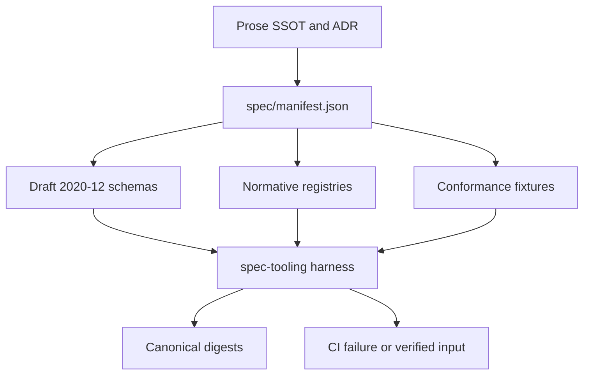

# P1 Normative Specification Harness — Implementation Report

**Date:** 2026-09-01 \
**Status:** IMPLEMENTED — first Foundation code entry point \
**Scope:** P1 plus the first P2 identity/domain slice \
**Related plan:** [Axiom v0.1 Foundation Reconciliation & Implementation Plan](../plans/2026-09-01-v0.1-foundation-and-implementation-plan.md)

## 1. Outcome

The first new-architecture code path is executable through:

```bash
pnpm spec:check
```

It validates the machine-readable authority before generated TypeScript,
compiler, behavior, or React work begins. The current checkpoint contains:

| Artifact | Count | Result |
| --- | ---: | --- |
| Draft 2020-12 schemas | 8 | registered and reference-checked |
| Normative registries | 1 | schema and semantic validation |
| Token Domains | 24 | explicit id/type/constraint/serializer records |
| Positive fixtures | 4 | must pass |
| Negative fixtures | 8 | must fail for the intended class of error |
| Canonical digests | 2 | manifest and Token Domain Registry |

This does not declare Token Foundation complete. It establishes the authority,
validation, diagnostic, and determinism substrate on which the remaining Token,
CSS, Recipe, Condition, Motion, Behavior, and React contracts can be added.

## 2. Implemented dependency flow



The package boundary is deliberate:

- `@axiom/spec-tooling` is build/test tooling, not browser runtime code;
- Ajv is its only runtime dependency;
- the Token Domain Registry remains independent from Web CSS property data;
- future generated types consume verified schema/registry inputs instead of
  becoming an alternate source of truth;
- existing Recipe, Tailwind, Behavior, and React spike packages are not yet
  rewired to the new inputs.

## 3. Source layout

```text
spec/
  manifest.json
  spec-manifest.schema.json
  common/
    identifier.schema.json
    source-location.schema.json
    token-reference.schema.json
    diagnostic.schema.json
  token/
    token-tier.schema.json
    token-identity.schema.json
    token-domain-registry.schema.json
    token-domain-registry.json
  fixtures/
    common-diagnostic/
    common-token-reference/
    token-domain-registry/
    token-identity/

packages/spec-tooling/src/
  canonical-json.ts
  semantic-validators.ts
  spec-harness.ts
  types.ts
  cli.ts
```

`spec/manifest.json` is the discovery boundary. A schema file silently added
outside the manifest fails the inventory check; a manifest entry with the wrong
`$id`, an unresolved `$ref`, or an unavailable fixture directory also fails.

## 4. Validation layers

### 4.1 Structural validation

Ajv 2020 validates the declared schemas and instances with strict mode and
`allErrors` enabled. Common contracts currently cover:

- stable identifiers;
- JSON Pointer-aware source locations;
- Axiom diagnostic envelopes;
- Appearance-to-Token references;
- Token tier and normalized Token identity;
- Token Domain Registry records and constraints.

Unknown instance fields are rejected through explicit
`unevaluatedProperties: false` boundaries where the contract is closed.

### 4.2 Semantic validation

Some invariants cannot be expressed usefully as local JSON Schema keywords.
The harness therefore runs named, Axiom-owned semantic validators after schema
success. The first validators enforce:

- unique Token Domain ids and roots;
- v0.1 Domain id/root equality;
- deterministic Domain ordering;
- constraint kind ↔ allowed DTCG type compatibility;
- unambiguous inclusive/exclusive range declarations;
- normalized Token path domain/tier agreement.

Negative fixtures prove both schema failures and semantic failures. A negative
fixture that unexpectedly passes both layers fails the command.

## 5. Token Domain Registry checkpoint

The initial registry materializes the complete v0.1 domain vocabulary already
accepted by SSOT-01 and the Token/CSS binding catalog:

| Family | Domains |
| --- | --- |
| Paint/effect | `color`, `gradient`, `shadow`, `blur`, `opacity` |
| Spacing/size | `space`, `size`, `aspectRatio`, `breakpoint` |
| Shape/stroke | `radius`, `borderWidth`, `strokeWidth`, `strokeStyle`, `border` |
| Typography | `fontFamily`, `fontSize`, `fontWeight`, `lineHeight`, `letterSpacing`, `typography` |
| Motion | `duration`, `easing`, `transition` |
| Layer | `layer` |

Each entry records its accepted DTCG type, Axiom-owned range constraints where
needed, and stable serializer identifiers. These serializer identifiers are
references to future compiler ports; the implementations do not live in Token
Foundation.

Notably, `margin` and `padding` are not Token Domains. Both consume `space`
through the future CSS Token Binding Catalog and sparse Property Policy. This
keeps design meaning independent from the growing Web CSS property vocabulary.

## 6. Canonical JSON and digest contract

`canonicalJson()` recursively sorts object keys while preserving array order,
normalizes negative zero, appends one terminal newline, and rejects:

- non-finite numbers;
- `undefined`, functions, symbols, and bigint;
- cyclic structures;
- non-plain object instances.

`canonicalJsonDigest()` emits a `sha256:<hex>` identifier over that byte form.
The manifest and every normative registry use this function, giving future
compiler inputs a stable provenance key without depending on source formatting
or object insertion order.

This is Axiom's repository contract, not a claim of conformance to an external
canonical-JSON RFC. Changing it after published artifacts exist requires an ADR
and digest-version migration.

## 7. Diagnostics and source locations

The common diagnostic schema establishes the cross-phase envelope:

```ts
interface Diagnostic {
  code: string;
  severity: "error" | "warning" | "info";
  phase:
    | "schema"
    | "token"
    | "property"
    | "recipe"
    | "normalization"
    | "condition"
    | "motion"
    | "compiler"
    | "behavior"
    | "react";
  message: string;
  location?: {
    file: string;
    pointer: string;
    line?: number;
    column?: number;
  };
}
```

Semantic Token checks currently emit `AXT1xxx`. Later phases must retain the
same envelope while using their documented namespaces.

## 8. Commands and CI integration

The root command order is now:

```text
check:boundaries
      ↓
spec:check
      ↓
generate:check
      ↓
TypeScript project build check
```

Use the following acceptance sequence for Foundation changes:

```bash
pnpm spec:check
pnpm test
pnpm check
pnpm build
```

The Vitest suite also invokes the complete specification harness, while the CLI
keeps it independently usable in CI and during schema authoring.

### Verified result at this checkpoint

| Command | Result |
| --- | --- |
| `pnpm spec:check` | pass — 8 schemas, 1 registry, 4 positive and 8 negative fixtures |
| `pnpm test` | pass — 8 test files, 22 tests |
| `pnpm check` | pass — boundaries, spec, generated drift, TypeScript |
| `pnpm build` | pass — full project-reference build |
| `git diff --check` | pass |

## 9. Explicitly deferred work

The following remain P2 or later and are not implied by this checkpoint:

- DTCG 2025.10 source parsing and every-type fixtures;
- primitive/semantic/component alias graph validation;
- light/dark context source and resolved manifest schemas;
- generated Token path/domain TypeScript types;
- resolved value range validation and CSS serializer implementations;
- pinned Webref/CSSTree property profile generation;
- margin/padding Token Binding Catalog execution;
- Recipe Kernel and normalized Appearance IR;
- Responsive Condition and Motion IR;
- React Aria Behavioral Criteria manifests and projections.

## 10. Next code entry point

Continue at P2.1/P2.2 without changing the existing adapter:

1. add the `TokenParserPort` interface and pin `@terrazzo/parser` behind it;
2. add DTCG source document and normalized Token record schemas;
3. add positive/negative fixtures for all 13 DTCG 2025.10 types;
4. move domain/tier path parsing from the harness into an Axiom Token
   normalization module that consumes the registry;
5. add tier-edge and Domain ↔ DTCG type diagnostics;
6. generate reference TypeScript unions from the verified registry only after
   those fixtures pass.

The parser port is the next executable boundary because context resolution,
component-token promotion, CSS binding, and Recipe authoring all depend on a
stable normalized Token record rather than raw source objects.
