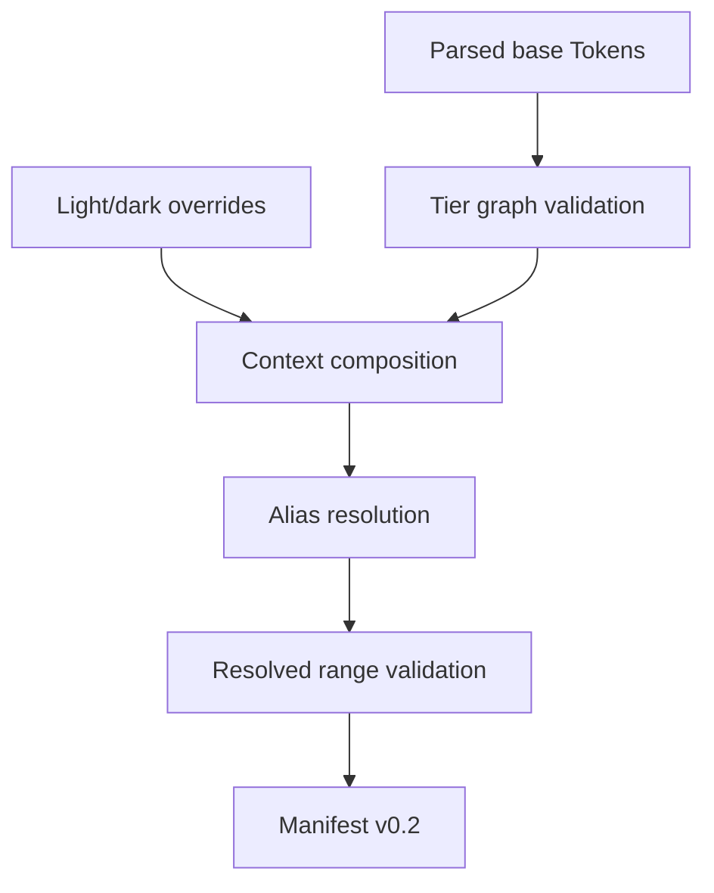

# P2.3/P2.4 Tier Graph & Context Resolver — Implementation Report

**Date:** 2026-09-01 \
**Status:** IMPLEMENTED — P2.3 and P2.4 complete \
**Scope:** tier graph, alias resolution, light/dark composition, resolved
manifest and deterministic serialization \
**Related plan:** [Axiom Foundation Reconciliation & Implementation Plan](../plans/2026-09-01-foundation-and-implementation-plan.md)

## 1. Outcome

The normalized document produced by P2.1 can now be transformed into a
context-complete, JSON-serializable Resolved Token Manifest:



The result is still independent from CSS, Recipe, React Aria, and the existing
Adapter spike. It is the first Token artifact eligible to become a future
compiler input.

## 2. Theme remains a Resolver context

No theme segment is added to a Token ID:

```text
color.semantic.surface.default       correct
color.dark.semantic.surface.default  forbidden model
```

The same stable Token ID is evaluated under two registered contexts:

```json
{ "theme": "light" }
{ "theme": "dark" }
```

`spec/token/resolver-modifier-registry.json` is the authority for modifier and
value order. v0.1 registers exactly one modifier, `theme`, and exactly two
values in output order: `light`, then `dark`.

## 3. Tier graph contract

Base-source rules are stricter than context override rules:

| Source | From | Allowed target/value |
| --- | --- | --- |
| base | Primitive | Primitive or explicit value |
| base | Semantic | Primitive, Semantic, or explicit value |
| base | Component | direct Semantic alias only |
| context | Semantic | Primitive, Semantic, or explicit value |
| context | Component | Semantic, Component, or documented explicit value |

The direct Component → Semantic base rule ensures that every Component Token
starts from a shared design role rather than becoming an unconstrained private
scale. A Component context exception requires a non-empty description and
emits informational diagnostic `AXT1506` for promotion-policy review.

Every reference participates in cycle and tier-edge analysis. Whole-Token
aliases additionally preserve Domain and DTCG type. Nested composite fields
follow their DTCG field types, allowing a `border` Token to reference `color`
and `borderWidth` Tokens without falsely requiring the top-level Domain to
match.

## 4. Context composition algorithm

For every registered context, the resolver performs:

```text
1. validate the complete base graph
2. locate the exact context override document
3. reject new Token IDs and Primitive overrides
4. preserve id, tier, Domain, and DTCG type
5. apply Semantic overrides
6. apply documented Component overrides
7. validate the effective graph again
8. recursively resolve whole and composite-field aliases
9. re-run Domain numeric/range constraints on resolved values
10. emit the complete sorted Token set
```

Both context documents are required even when one contains no overrides. This
makes context completeness explicit instead of relying on a hidden fallback.

## 5. Example

Base definitions:

```json
{
  "color.primitive.neutral.0": "white value",
  "color.primitive.neutral.900": "black value",
  "color.semantic.surface.default": "{color.primitive.neutral.0}",
  "color.component.button.root.background.default":
    "{color.semantic.surface.default}"
}
```

Dark context override:

```json
{
  "schemaVersion": "0.1",
  "context": { "theme": "dark" },
  "tokens": [
    {
      "id": "color.semantic.surface.default",
      "domain": "color",
      "tier": "semantic",
      "dtcgType": "color",
      "value": "{color.primitive.neutral.900}",
      "aliasTarget": "color.primitive.neutral.900",
      "source": {
        "file": "file:///tokens/theme-dark.tokens.json",
        "pointer": "/color/semantic/surface/default"
      }
    }
  ]
}
```

The Component Token is not directly overridden, but resolves transitively to
white in light context and black in dark context. Its manifest entry retains a
direct dependency on `color.semantic.surface.default`; the Semantic entry
records the context-specific Primitive dependency.

## 6. Resolved manifest contract

The normative schema is
`spec/token/resolved-token-manifest.schema.json` with schema version `0.2`.
Each entry contains:

```ts
interface ResolvedTokenEntry {
  id: TokenId;
  domain: TokenDomain;
  tier: TokenTier;
  dtcgType: DtcgType;
  resolvedValue: JsonValue;
  source: TokenSourceLocation;
  dependencies: readonly TokenId[];
  description?: string;
  deprecated?: boolean | string;
}
```

`dependencies` is the sorted set of direct references in the effective
context. Since every referenced Token must exist in that context, the complete
dependency graph remains reconstructable without exposing an unresolved value
or parser object.

The semantic manifest validator enforces:

- exact `light`, then `dark` context order;
- the same sorted Token IDs in every context;
- dependencies that exist in the same context;
- no remaining `{token.reference}` value at any nested depth;
- normalized ID/domain/tier agreement.

## 7. Determinism

Determinism does not depend on authoring order:

- base and override Token input order is ignored;
- context input order is ignored;
- output contexts follow Resolver Modifier Registry order;
- output Tokens and direct dependencies are lexically sorted;
- object keys inside resolved values are normalized;
- `serializeResolvedTokenManifest()` emits stable two-space JSON with one
  terminal newline.

Tests prove that reversed base/context inputs produce equal runtime objects and
identical serialized bytes.

## 8. Diagnostics

| Code | Meaning |
| --- | --- |
| `AXT1400` | unknown alias target |
| `AXT1401` | forbidden tier edge |
| `AXT1402` | whole-alias Domain mismatch |
| `AXT1403` | whole-alias DTCG type mismatch |
| `AXT1404` | alias cycle |
| `AXT1405` | Component base is not a direct Semantic alias |
| `AXT1500` | unknown/malformed Resolver context |
| `AXT1501` | duplicate or missing required context |
| `AXT1502` | context introduces a new Token |
| `AXT1503` | context overrides a Primitive Token |
| `AXT1504` | context changes immutable metadata |
| `AXT1505` | Component context exception lacks description |
| `AXT1506` | Component context exception review information |
| `AXT1600–1603` | resolved-manifest ordering/completeness/reference errors |

Resolved values also reuse Domain constraint diagnostic `AXT1202`.

## 9. Normative and executable artifacts

```text
spec/token/token-context.schema.json
spec/token/token-context-override.schema.json
spec/token/resolver-modifier-registry.schema.json
spec/token/resolver-modifier-registry.json
spec/token/resolved-token-manifest.schema.json

packages/tokens/src/resolution/context-resolver.ts
packages/tokens/src/resolution/manifest-serializer.ts
packages/tokens/src/resolution/context-resolver.test.ts
```

The specification harness now validates 16 schemas, three registries/profiles,
eight positive fixtures, and 17 negative fixtures.

## 10. Conformance coverage

Executable tests cover:

- Primitive/Semantic/Component transitive light/dark resolution;
- nested DTCG composite references across compatible field Domains;
- deterministic ordering and serialization;
- documented Component context exceptions;
- unknown targets, illegal tier edges, Domain/type mismatch, and cycles;
- missing contexts, new IDs, Primitive overrides, and invariant changes;
- post-resolution opacity range validation;
- manifest context completeness and unresolved-reference rejection.

## 11. Deliberately deferred

Token Foundation still has two major remaining slices:

1. finish P2.2 generated `TokenDomain`, `TokenTier`, and public Token path types
   after the normative source corpus is introduced;
2. implement P2.5 composite projectors and CSS serializers for typography,
   border, shadow, transition, gradient, blur, and related outputs.

The Resolved Token Manifest must remain disconnected from the existing
Tailwind/React spike until the remaining Foundation gates and CSS Property
Profile contracts pass.
