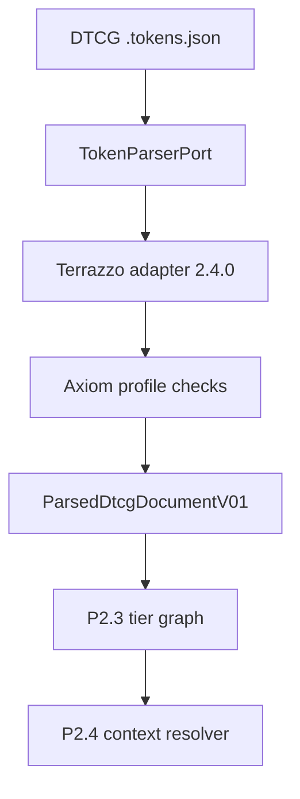

# P2.1 DTCG Parser & Normalization Boundary — Implementation Report

**Date:** 2026-09-01 \
**Status:** IMPLEMENTED — P2.1 complete, bounded P2.2 slice complete \
**Scope:** parser port, DTCG source profile, normalized token document,
identity/Domain/type/range validation \
**Related plan:** [Axiom v0.1 Foundation Reconciliation & Implementation Plan](../plans/2026-09-01-v0.1-foundation-and-implementation-plan.md)

## 1. Outcome

Axiom now accepts raw `.tokens.json` documents through a replaceable parser
port and returns only Axiom-owned, JSON-serializable records. The reference
adapter pins `@terrazzo/parser` `2.4.0`, but Terrazzo's AST, resolver, node,
group, and source object types do not cross the port.



This is deliberately not yet a resolved token manifest. Whole-token aliases
remain aliases, theme/context precedence has not run, and no CSS value has
been serialized.

## 2. Authority and dependency boundary

| Layer | Owns | Must not own |
| --- | --- | --- |
| DTCG 2025.10 | source value shapes and 13 standard `$type` values | Axiom Domain/tier meaning |
| Token Domain Registry | Domain vocabulary, allowed DTCG types, numeric constraints | parser AST or CSS property policy |
| `@axiom/tokens` | port/contracts, identity parsing, Domain/type/range diagnostics | Terrazzo dependency |
| `@axiom/token-tooling` | Terrazzo adapter and parser-specific error translation | public manifest types |
| Later resolver | alias graph, tier edges, theme contexts, resolved values | raw source parsing |

The dependency direction is therefore:

```text
@axiom/token-tooling → @axiom/tokens
@axiom/token-tooling → @terrazzo/parser
@axiom/tokens        ↛ @terrazzo/parser
```

The boundary checker enforces this direction. Existing Recipe, Web/Tailwind,
Behavior, and React packages are intentionally not connected to this code path.

## 3. Pinned source profile

`spec/token/token-source-profile.json` records:

- DTCG version `2025.10`;
- the `.tokens.json` extension;
- `<domain>.<tier>.<tier-specific-path>` identity grammar;
- all 13 standard DTCG types;
- parser package and exact version;
- `resolveAliases: false` and `skipLint: false`.

The standard type set is:

```text
color, dimension, fontFamily, fontWeight, duration, cubicBezier, number,
strokeStyle, border, transition, shadow, gradient, typography
```

References: [DTCG Format Module 2025.10](https://www.designtokens.org/TR/2025.10/format/),
[Terrazzo JavaScript API](https://terrazzo.app/docs/reference/js-api/), and
[`@terrazzo/parser` 2.4.0](https://www.npmjs.com/package/@terrazzo/parser).

## 4. Why the adapter adds Axiom validation

Terrazzo is a parser implementation, not the Axiom specification authority.
Its accepted input is intentionally wider than Axiom's pinned DTCG profile.
For example, the parser can accept extension types and an `em` dimension,
while the DTCG 2025.10 source profile used here admits `px`/`rem` dimensions
and `ms`/`s` durations.

Axiom therefore performs four checks after parsing:

| Diagnostic | Check | Example rejection |
| --- | --- | --- |
| `AXT1100–1105` | explicit Domain/tier/path identity | missing tier, unknown Domain |
| `AXT1200` | standard DTCG type set | Terrazzo `boolean` extension |
| `AXT1201` | Domain ↔ DTCG type compatibility | `space` with `color` |
| `AXT1202` | Domain-owned numeric constraints | opacity `1.5`, negative Primitive space |
| `AXT1203` | DTCG source unit profile | dimension unit `em` |

Parser syntax/value-shape failures become `AXT0002`. Empty input becomes
`AXT0001`. Alias values skip numeric range validation at this stage because
their resolved value is not available until P2.3/P2.4.

## 5. Normalized data contract

Input is a source document, not a filesystem lookup hidden inside Core:

```ts
interface TokenSourceDocumentV01 {
  readonly filename: URL;
  readonly content: string;
}

interface TokenParserPort {
  parse(
    sources: readonly TokenSourceDocumentV01[],
  ): Promise<ParsedDtcgDocumentV01>;
}
```

Given this authored DTCG source:

```json
{
  "color": {
    "primitive": {
      "brand": {
        "$type": "color",
        "$value": {
          "colorSpace": "srgb",
          "components": [0.1, 0.3, 0.8],
          "alpha": 1
        }
      }
    },
    "semantic": {
      "accent": {
        "$type": "color",
        "$value": "{color.primitive.brand}"
      }
    }
  }
}
```

the adapter emits the following conceptual Axiom record for the alias:

```json
{
  "id": "color.semantic.accent",
  "domain": "color",
  "tier": "semantic",
  "dtcgType": "color",
  "value": "{color.primitive.brand}",
  "aliasTarget": "color.primitive.brand",
  "source": {
    "file": "file:///.../alias.tokens.json",
    "pointer": "/color/semantic/accent"
  }
}
```

The record contains no parser class instance or behavior. It survives
`JSON.stringify → JSON.parse` with equivalent meaning. Source input order is
sorted before parsing, and token output is sorted by normalized id.

## 6. Schema and fixture inventory

This checkpoint adds the following normative contracts:

```text
spec/token/token-id.schema.json
spec/token/token-source-profile.schema.json
spec/token/token-source-profile.json
spec/token/normalized-token-record.schema.json
spec/token/parsed-token-document.schema.json
```

The specification manifest now covers 12 schemas, two registries/profiles,
six positive schema fixtures, and 12 negative schema fixtures. Raw parser
fixtures separately cover:

- every one of the 13 DTCG 2025.10 types;
- a preserved whole-token alias;
- source-order determinism and path-independent identity;
- malformed DTCG values;
- unknown Domain, missing tier, and Domain/type mismatch;
- extension type and unit rejection;
- opacity, layer, and spacing constraints;
- absence of Terrazzo `node`, `group`, and `originalValue` data.

## 7. Implementation entry points

| Purpose | Entry point |
| --- | --- |
| Axiom parser contract and data model | `packages/tokens/src/v0-1/contracts.ts` |
| Identity and Domain validation | `packages/tokens/src/v0-1/identity.ts` |
| Terrazzo reference adapter | `packages/token-tooling/src/terrazzo-token-parser.ts` |
| Raw DTCG conformance fixtures | `fixtures/token/dtcg/` |
| Parsed-document semantic validation | `packages/spec-tooling/src/semantic-validators.ts` |

Consumer tooling constructs the adapter with the verified Domain Registry:

```ts
import { createTerrazzoTokenParser } from "@axiom/token-tooling/terrazzo";

const parser = createTerrazzoTokenParser({ domains: registry.domains });
const parsed = await parser.parse(sources);
```

This object is the input to later Token Foundation stages, not to the Web
Adapter or React runtime.

## 8. Verification

The checkpoint acceptance sequence is:

```bash
pnpm spec:check
pnpm test
pnpm check
pnpm build
git diff --check
```

Targeted parser/identity tests pass before the repository-wide sequence.

## 9. Deliberately deferred

P2 Token Foundation is not complete. The next code entry point is P2.3/P2.4:

1. validate primitive/semantic/component tier edges and alias cycles;
2. resolve whole-token aliases with dependency traces;
3. define light/dark context source precedence and completeness;
4. emit byte-stable resolved context manifests;
5. generate `TokenDomain`, `TokenTier`, and public Token path types from
   verified source/registry inputs;
6. validate constraints again after resolution;
7. only then implement composite projectors and CSS serializers.

Until those steps pass, this parsed document must not be treated as an Adapter
input or a release-ready token manifest.
